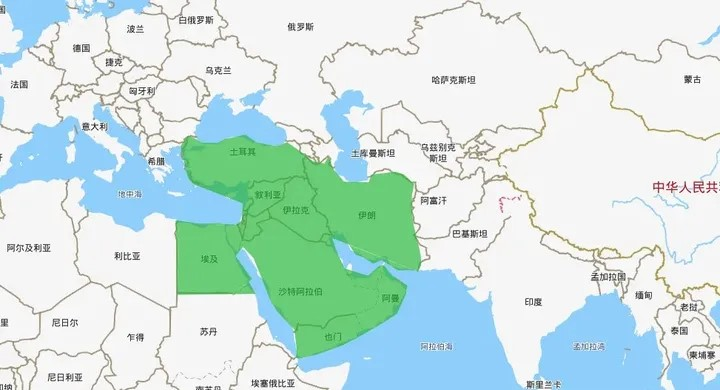

    

        ✨参考资料 
    

https://zhuanlan.zhihu.com/p/472849185  
https://zhuanlan.zhihu.com/p/469785892  

https://news.ifeng.com/history/special/zhongdongzhanzheng/  
https://zhuanlan.zhihu.com/p/386130854  
https://zhuanlan.zhihu.com/p/355752880  

---

    

        ✨近代一些战役
    

### ⭕ 第二次世界大战

时间段在 1939 ~ 1945 年  
大约有 7000 万人遇难，其中包括士兵、平民、大屠杀  
（假设 1 平方米的面积可以站 4 个人，那么三个半足球场可以站 10 万人，7000 万人需要 2450 个足球场）  

- 两大阵营
    - 法西斯轴心国  
        德、意、日等  
        仆从国有：保加利亚、匈牙利、罗马尼亚等  
    - 反法西斯同盟国  
        美、苏、英、法、中华民国等  

各国的指挥官：

| 美 | 苏 | 英 | 法 | 中 | 德 | 意 | 日 |
| --- | --- | --- | --- | --- | --- | --- | --- |
| 罗斯福 | 斯大林 | 丘吉尔 | 戴高乐等人 | 蒋介石 | 希特勒 | 墨索里尼 | 裕仁天皇、东条英机 |

开始标志：德国闪击波兰

转折点：斯大林格勒保卫战，中途岛战役

最终，反法西斯同盟国和世界人民一起赢得了胜利

### ⭕ 中东战争

  
中东连接着欧亚非三个大陆板块，是人类古老文明的摇篮  
一百多年前的中东是一个大一统帝国——奥斯曼帝国，后来由于一战爆发，作为盟约国的奥斯曼帝国输了，被瓜分肢解，仅剩土耳其一隅。故中东陆续独立出来如今的诸国，由于当时各国的分界线是一战战胜国英法私下谈判的，这为后来中东多国的宗教、种族之间的冲突埋下了隐患  

总共 5 次  

第一次：巴以冲突  
1948 ~ 1949 年  
公元前13世纪，犹太人迁入耶路撒冷定居
公元66年，罗马帝国统治后，将耶路撒冷所在行省改为巴勒斯坦，并驱逐了部分的犹太人
公元7世纪，阿拉伯人占领巴勒斯坦
1914年一战爆发后，巴勒斯坦的统治者奥斯曼帝国和德意志联盟开始驱逐犹太人。犹太人转而帮助英国，英国政府承若战后会帮助犹太人独立，但是之后并没有履行承诺
1945年二战结束后，欧洲各地的集中营放出大量的犹太难民，西方各国不愿接受难民，英国苦于移民控制的压力，将巴勒斯坦的控制问题交给联合国
1947年，联合国同意阿拉伯人和犹太人在巴勒斯坦上各自建立国家。但是阿拉伯人不接受这个决议，因为由于犹太人一直购买土地，所以阿拉伯人人多且土地少，犹太人人少且沿海肥沃土地多
1948年，犹太人单方面宣布成立犹太国，定名为以色列。但是就在第二天，周围的阿拉伯联盟国家：埃及、伊拉克、黎巴嫩、叙利亚、约旦的军队就向以色列宣战，巴以冲突爆发
但是之后世界各地的犹太人集结以色列，美国的犹太财团筹集资金购买军事装备，短短几周内以色列就诞生了正规的国防军
此时美英站巴勒斯坦，苏联站以色列这边，提供军火，帮助训练军队
由于阿拉伯联盟国家内部矛盾，加上以色列犹太人的经济实力，巴勒斯坦的阿拉伯人势力范围逐渐缩小

第二次：两伊战争  
伊拉克挑事袭击伊朗，伊朗反击
伊拉克掌权人萨达姆抓住伊朗内部政权不稳定，闹革命，想要挑事主要有三个目的：  
1、想要获取两伊交界地带的阿拉伯河的出海段  
2、防止伊朗输出革命，伊朗的伊斯兰教中的“什叶派”革命成功，伊拉克担心自己被渗透  
3、伊朗的波斯人，伊拉克的阿拉伯人，各自国家的人民在对方国家内部被欺凌  

持续8年的两伊战争，双方损失惨重，民不聊生，最终局面没有什么变化

第三次：海湾战争  
两伊战争中，伊拉克因为战争欠了很多外债。故想要减少石油产量，使得石油价格上涨，赚钱还债；而邻国的科威特（依赖美国）反其道而行之  
萨达姆将自己展示为一个敢于反抗以色列和美国的政治家，趁着国际局势动荡，打算占领吞并科威特  
萨达姆认为美国不会轻易出手，因为朝鲜战争和越南战争的原因，美国国内反战情绪严重  
迫于压力，美国同意通过谈判解决问题，但是萨达姆的态度却更加强硬，这一举动使得美国民意反弹，美国直接对伊拉克进行军事行动  
这一战，美国展现了强大的实力，是一场现代高科技战争。死亡人数比例为 286:100000

此战之后，中国裁军近100万，省下的钱用于高科技武器研制的投入，并进行军事武器、思想、理论的改革

第四次：阿富汗战争  
美国反恐战争
2001年9月11日，美国纽约世界贸易中心两栋大楼被恐怖分子袭击
美国对阿富汗基地组织和塔利班进行报复战争，目的是逮捕本拉登和基地组织的成员
塔利班建立的初心是为了抵御当时苏联红军的入侵，苏军退兵后，转而将目标定为美国和伊斯兰世界的腐败组织
阿富汗战争持续十余年，在2011年，美军在巴基斯坦将本拉登击毙

第五次：伊拉克战争  
2003年，美国单方面对伊拉克实施军事打击
原因是称伊拉克藏有大规模杀伤性生化武器
但直到伊拉克战争结束，都没有找到  
一方面是萨达姆的行为太过猖狂，不断和美国叫嚣；另一方面美国可以震慑中东的其他国家

### ⭕ 朝鲜战争

### ⭕ 越南战争

### ⭕ 中印边境战争

### ⭕ 中越边境战争

### ⭕ 东欧剧变

### ⭕ 海湾战争

### ⭕ 前南斯拉夫解体、苏联解体

### ⭕ 科索沃战争

### ⭕ 阿富汗战争

### ⭕ 伊拉克战争

### ⭕ 俄罗斯-格鲁吉亚战争

### ⭕ 利比亚战争

### ⭕ 叙利亚内战

### ⭕ 俄乌冲突

