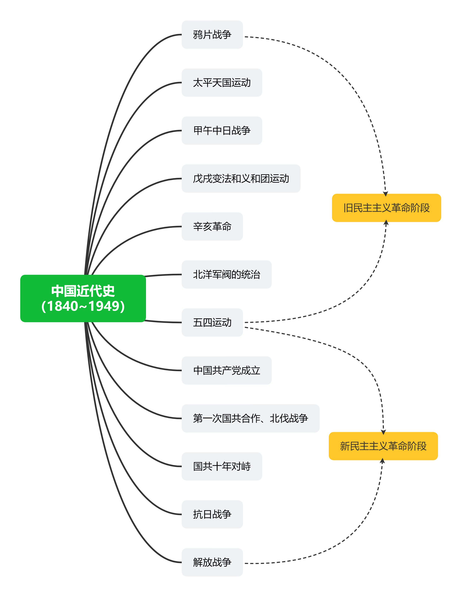

    

        ✨参考资料 
    

https://www.gov.cn/guoqing/2020-10/29/content_5555766.htm  
https://www.iodraw.com/mind  
https://photokit.com/colors/color-wheel/?lang=zh  

---

    

    

        ✨旧民主主义革命阶段 
    

### ⭕ 鸦片战争

原本中国是 独立自主的封建国家  
当时中国的自然经济处于统治地位，中英贸易中处于出超地位  

> [!NOTE|style:flat]
> 贸易出超：即贸易顺差，一定时间内出口额 > 进口额，收支盈余  
贸易入超：即贸易逆差，一定时间内出口额 < 进口额，赤字  

英国不法商人使坏，向中国走私鸦片，给我国带来深重灾难  
林则徐（开眼看世界第一人）在广州发起禁烟运动，在虎门集中销毁鸦片  
英国于 1840 年发动鸦片战争，1842 年清政府被迫签订 《南京条约》，中国主权独立和领土完整开始遭到破坏  

之后 1856~1860 年间，英法为了扩大侵略权益，发动第二次鸦片战争，美俄趁火打劫，期间又签订了一系列条约  

### ⭕ 太平天国运动

第一次鸦片战争激化了国内的阶级矛盾，出现农民起义  
1851 年 洪秀全 发动金田起义，建立太平天国政权，前期政权势力不断强大，沉痛打击了清王朝的封建统治  
但是后期内部矛盾显现，经 天京事变 后，太平天国元气大伤  
1864 年，太平天国运动在中外势力的绞杀下失败  

### ⭕ 阶级的产生

19 世纪 40 年代，无产阶级产生，其具有最坚决、最彻底的革命性  

19 世纪 60~70 年代，民族资产阶级 产生  

一些领导人主张学习西方资本主义，探索发展中国的道路  
19 世纪 60~90 年代，洋务运动，口号：自强、求富。魏源在《海国图志》中提出 “师夷长技以制夷”  
这场运动客观上刺激中国的资本主义发展，促进近代化历程  

### ⭕ 民族危机加深

1894 年，甲午中日战争 爆发，中日签订 《马关条约》，给人民带来沉重负担，大大加深中国的半殖民地化  
之后帝国主义列强掀起瓜分中国的浪潮  

### ⭕ 戊戌变法、义和团运动

随着危机加深，民族资产阶级作为新的政治力量登上历史舞台  
以康有为、梁启超为首的 资产阶级维新派 发起爱国的 戊戌变法（或叫维新变法）运动，后面由于慈禧太后为首的封建守旧势力的政变而以失败告终  
这场资产阶级改良运动，在社会上起到 思想启蒙 的作用  

1900 年夏，八国联军侵华  
义和团运动 是一场反帝爱国的农民运动，口号：扶清灭洋  
虽然最终运动失败，但是粉碎了帝国主义列强企图瓜分中国的狂妄计划，也一定程度上加速了清政府的灭亡  
之后与十一个国家签订了丧权辱国的 《辛丑条约》，标志着 中国半殖民地半封建社会的形成  

### ⭕ 辛亥革命

1894 年，孙中山 创立兴中会 —— 中国第一个资产阶级革命团体  
1905 年，中国同盟会成立，标志着中国 资产阶级民主革命 进入一个新的阶段  
1911 年 10 月，武昌起义 成功  

1912 年元旦，孙中山在南京就任临时大总统，宣告 中华民国 成立，颁布了《中华民国临时约法》，这意味着中国两千多年的封建专制主义的君主制度被推翻了！资产阶级民主共和国之下，人民拥有了一些自由和民主的权利，打击了列强在中国的殖民统治  
但是，由于中国资产阶级的软弱和局限性，他们 **不愿意同帝国主义完全裂决，也无法依靠、发动人民进行彻底的社会革命，所以这场运动并没有完全完成反帝反封建**  

### ⭕ 北洋军阀

1912 年，袁世凯 篡夺了辛亥革命的果实，就任临时大总统，并将临时政府迁往北京。以袁世凯为首的北洋军阀政权 产生  
袁世凯对内镇压国民党，对外出卖国家主权。在孙中山号召下，“二次革命”开始，但是不久便失败  
之后袁世凯开始 复辟封建帝制，1915 年的 护国运动 爆发后才得以取消  
袁世凯死后，出现了 军阀割据 的局面  

> [!NOTE|style:flat]
> 当时正处于一战时期，帝国主义忙于战争，中国的民族企业得到短暂的发展  

---

    

        ✨新民主主义革命阶段 
    

### ⭕ 五四运动

新文化运动 产生的背景：  
资本主义经济进一步发展，资产阶级要求在中国实行 资产阶级民主政治，反对封建军阀统治  
兴起的标志：1915 年，陈独秀 在上海创办《新青年》  
口号：民主、科学  

俄国 十月革命 胜利，李大钊 在国内宣传十月革命，中国第一次举起社会主义大旗，新文化运动有了新的发展  

1919 年，北京，五四运动 爆发  
导火索：巴黎和会上拒绝了中国代表的正义要求，把战败国在中国山东的权益转让给了日本，人民义愤填膺  
意义：中国新民主主义革命的开端  

### ⭕ 中国共产党成立

五四运动后，马克思主义 在中国传开，马克思主义和 工人运动 初步结合  
首先在 1920 年共产党小组相继成立，终于，在 1921 年 中共一大 召开，中国共产党正式成立  

### ⭕ 第一次国共合作、北伐战争

1923 年，二七惨案，军阀 吴佩孚 武力镇压罢工的工人，造成震惊中外的流血事件  
中国共产党意识到，仅靠工人阶级的力量是不够的  
1924 年 1 月，国民党“一大” 召开，标志着 国共两党合作的实现、革命统一战线的正式建立  
之后 国民大革命，反帝爱国运动接连不断，影响最大的有：五卅运动、省港大罢工等等  

1925 年 7 月，国民政府在广州成立，所属军队编为 国民革命军  
1926 年 7 月，国民政府誓师北伐，北伐战争 最后取得胜利  

1925 年 3 月孙中山逝世，国民党右派 加速争夺革命领导权，1927 年后一再发动反革命政变  
1927 年 5 月，汪精卫 在武汉发动 七一五政变，标志着第一次国共合作破裂  

### ⭕ 国共十年对峙

国民政府形式上统一了中国，但是 新军阀的混战 却给人民带来了极大的灾难  
凭借政权迅速聚敛巨额财富，成为了 官僚买办资产阶级 的代表  

1927 年，中国共产党召开 八七会议，纠正右倾投降主义错误  
并接连发动了南昌起义、秋收起义、广州起义，创建了 红军，开辟了 农村根据地，进行了 土地改革，创建了 中国苏维埃政权  
开辟 农村包围城市，武装夺取政权的道路  

1930 年~1933 年，蒋介石对革命根据地发动了四次围剿，红军取得了四次反围剿的胜利！  
第五次围剿时，王明左倾错误，红军反围剿失利，被迫 长征  
长征期间，举行了 遵义会议，毛泽东 带领红军取得长征的胜利  

1932 年 12 月 12 日，西安事变，中国共产党最终决定和平解决西安事变，这开启了国共两党合作的第二次可能，也标志着抗日民族统一战线的初步形成  

### ⭕ 抗日战争

1931 年，日本在 沈阳 发动 九一八事变，挑起侵华战争。但是当时国民党政府奉行 不抵抗政策  
不到半年的时间，东北三省全部沦陷，国内必然掀起抗日救亡的怒潮  

1935 年，日本在华北蓄意制造了一系列事端，威逼平津  
1935 年 12 月，中共中央在 瓦窑堡 召开会议，制定 抗日民族统一战线 的方针  

1937 年 7 月 7 日，日军制造 卢沟桥事变，全国抗日战争爆发  
抗战期间，八路军、新四军深入敌后，开辟敌后战场，开展游击战，与国民党军队的正面战场相互配合  

1941 年 12 月，太平洋战争 爆发，中国抗日战争成为世界反法西斯战争的重要组成部分  
1945 年 8 月 15 日，日本政府宣布无条件投降，9 月 2 日在美国战列舰上签订无条件投降书  
14 年艰苦奋战，最终取得伟大胜利  

### ⭕ 解放战争

抗日战争胜利后，为了国内和平，1945 年毛主席赴 重庆谈判，10 月 10 日国共签订《双十协定》  
1946 年 1 月，重庆，政治协商会议 召开  

1946 年夏，全面内战 爆发，国民党军队在美国的支持下向解放区发起进攻  
1948 年~1949 年，辽沈、淮海、平津三大战役，基本消灭了国民党军队的主力  
1949 年 4 月，渡江战役 解放了南京，推翻了国民党的统治  

1949 年 9 月，第一届全国人民政治协商会议 在北平召开  
会议选举毛泽东作为中央人民政府主席  
北平作为首都，更名北京  

