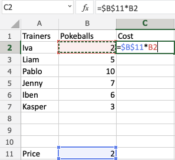

# *参考资料*

https://w3schools.cn/excel/index.html  

# *基本知识*

## Excel 适用领域

数据录入、管理、分析  
项目管理  
财务会计  

## 概述

单元格的引用是它的坐标。例如，C4 具 C 列和 4 行两者的交集处  
字母始终是列，数字始终是行  

Shift + F11 创建新的工作表

范围选择使用冒号 :  

## 填充  

支持复制、序列、日期、函数  
填充图标位于单元格的右下角，将鼠标悬停在其上后，鼠标图标会更改为十字  
单击并按住鼠标左键，拖动并标记要覆盖的范围  
复制，就是选中一个需要复制的单元格，按照上述操作后进行拖动即可复制  
序列，则需要fill函数能够理解，例如邻近两个单元格的值分别是1和2，shift选中二者后，再进行上述操作，则可自动填充序列（同样的字母＋数字也是可行的）  
日期序列，则只要在一个单元格中输入例如：29.07.2021，进行上述填充操作，Excel会自动进行时间的填充  
函数填充，比如某一列的值等于另外两列之和，在E2中输入公式 "=B2+C2"，注意B到E列都需要有列名，双击单元格右下角即可自动根据函数填充  

## 删除单元格

Delete键只会删除单元格中的值，不会删除格式（颜色等）

## 引用

相对引用  
示例:A1  

绝对引用  
示例 =$A$1 引用是绝对锁定的  
示例 =$A1 行仍是相对的  
示例 =A$1 列仍是相对的  

    

## 圆括号 () 

用于改变操作的顺序  
使用括号使 Excel 首先计算括号内的数字，然后再计算公式的其余部分  
使用更高级的公式时，可能需要嵌套括号，我们可以把它看成一个洋葱，它有很多层。Excel会先从内层开始计算  

## 函数

| 函数名 | 描述 |
| --- | --- |
| =IF | 根据 TRUE 或 FALSE 条件返回值 |
| =IFS | 根据 **一个或多个** TRUE 或 FALSE 条件返回值 |
| =AVERAGE | 计算平均值（**算术平均值**） |
| =AVERAGEIF | 根据 TRUE 或 FALSE 条件计算范围的平均值 |
| =AVERAGEIFS | 根据 **一个或多个** TRUE/FALSE 条件计算范围的平均值 |
| =COUNT | 对范围内数字的单元格进行 **计数** |
| =COUNTA | 计算范围内 **所有有值的单元格**，包括数字和字母 |
| =COUNTBLANK | 计算范围内的 **空白单元格** |
| =COUNTIF | 按指定条件对单元格计数 |
| =COUNTIFS | 根据 **一个或多个** TRUE 或 FALSE 条件对范围内的单元格进行计数 |
| =MAX | 返回范围内的 **最大值** |
| =MEDIAN | 返回数据的 **中间值** |
| =MIN | 返回范围内的 **最小值** |
| =MODE | 查找出现次数最多的数字，返回值是一个数字 |
| =STDEV.P | 计算整个 **总体** 的标准偏差 (Std) |
| =STDEV.S | 计算 **样本** 的标准偏差 (Std) |
| =SUM | 将一个范围内的数字 **求和** |
| =SUMIF | 根据 TRUE 或 FALSE 条件计算范围内值的总和 |
| =SUMIFS | 根据 **一个或多个** TRUE 或 FALSE 条件计算范围的总和 |
| =VLOOKUP | 允许 **垂直搜索** 表格中的值 |
| =AND | 与逻辑运算符，根据两个或多个条件返回 TRUE 或 FALSE |
| =OR | 或逻辑运算符，根据两个或多个条件返回 TRUE 或 FALSE |
| =XOR | 异或逻辑运算符，根据两个或多个条件返回 TRUE 或 FALSE |

VLOOKUP 函数  
允许跨列搜索  
`=VLOOKUP(lookup_value, table_array, col_index_num, [range_lookup])`  
函数的不同部分由符号分隔，可以使用逗号或者分号  

- 参数  
    lookup_value: 需要搜索的值对应的单元格  
    table_array: 表格范围，即表格的所有单元格  
    col_index_num: 需要查找的数据列的编号，从左数起  
    `[range_lookup]`: 如果是数字，则为 TRUE 或 (1)；如果是文本，则为 FALSE 或 (0)  

> 注意  
保存用于查找的数据列必须始终在 **左侧**  

# *数据分析操作*

## 排序

不建议单独对某列进行排序，因为这会破坏总的统计数据之间的关系（只有这列排序了，但是其他列不动）  

## 筛选

# *其它实用操作*

## 一键求和

`Alt + =` 可以一键对选中的单元格进行求和  

## 一键插入条形图  

`Alt + F1` 可以一键插入选中单元格的条形图  

## 单元格换行  

`Alt + Enter` 一个单元格中的内容太长或需要换行时使用  

## 快速移动数据  

`Alt + 左键` 可以快速移动选中的单元格  

## 快速生成下拉菜单  

`Alt + ↓`  

## 带单位数求和  

eg. 556箱，600箱……  
Q=556+600→ Ctrl + E(填充)  
→Ctrl + H(替换)，Q→ (替换为空)，全部替换  
`Ctrl + E` 可以填充序列，`Ctrl + H` 可以替换  

## 小写金额转大写  

选中单元格，右键点击【设置单元格格式】-【特殊】-【中文大写数字】，确定  

## 快速输入√×  

设置字体“wingdings 2”，开启大写  
P→√,O→×,R→□√,S→☒  

## 批量添加下划线  

选中单元格→设置单元格格式  
→自定义→@*_ →确定  

## 文字随单元格大小变化  

选中单元格，右键点击【设置单元格格式】-【对齐】-【缩小字体填充】，确定  

## 图片随单元格大小变化  

右击图片，【大小和属性】-属性栏中选择【随单元格改变位置和大小】  

## 快速提取数据  

先手动提取一行→Ctrl + E  
`Ctrl + E` 在 Excel 中通常用于刷新数据  

## 快速拆分数据  

先手动拆分一行→Ctrl + E  

## 快速合并数据  

先手动合并一行→Ctrl + E  

## 不同长短的姓名对齐  

选中单元格，右键点击【设置单元格格式】-【对齐】-【水平对齐】-【分散对齐】，确定  

## 单元格横向变纵向  

选中单元格，右键点击【复制】，选中需要粘贴的地方右键点击【转置】  

## 快速删除单元格中的空行  

F5 键【定位条件】，选择空值，点击确定  
右键点击【删除】  

## 快速修改照片底色背景  

选中图片来到【图片格式】，点击【删除背景】，用画笔【标记要保留的区域】-【保留修改】，之后点击油漆桶进行颜色的填充  

## 给姓名或文字添加拼音  

选中单元格→复制→（Wold文档）粘贴→全选→拼音→确定→复制→（Excel单元格）粘贴  

## 制作下拉列表  

选中单元格，菜单栏中的【数据】-【数据验证】-【设置】-【允许】选择序列，【来源】中填入 “选项A,选项B,……”，点击确定  

## 横向快速找不同  

选中单元格，`Ctrl + \`  

## 制作合同到期提醒  

表选中单元格→输入“=D2-TODAY()”,Ctrl + Enter(回车键)→数字→分类，常规→确定→条件格式，任选一个数据条  

## 快速输入当前日期和时间  

日期：`Ctrl + ;`  
时间：`Ctrl +Shift + ;`  

## 制作斜线表头  

选中单元格，`Ctrl + 1`-【字体】-设置好【上、下标及文字大小】  
【边框】-【斜线】  

## 定制专属二维码  

在选项中找到【自定义功能区】，打开【开发工具】，在插入中选择 【BarCode Control】，设置样式即可得到 QR 二维码

## 自动添加边框  

选中单元格，在开始栏中找到【样式】-【条件格式】-【新建规则】  
【使用公式……的单元格】-【格式】-【添加外边框】  

## 冻结窗格查看  

选中单元格，【视图】-【冻结...】  

## 快速单元格的整理美化  

选中单元格，`Ctrl + T` 可以将选中的数据范围转化为表格  

## 设置单元格格式  

双引号：需要添加的内容  
数字占位符：#"米"（通常使用#来代表原格式中的数字）  
零占位符："S"000（数字用0补足三位数，并在最前面添加字母S）  
空格占位符：??.???（整数两位，小数三位，位数不够以空格补齐）  
文本占位符：@！（@表示原有的文本内容，在文本后面加上感叹号）  
千位符：#.##0（使用逗号，并配合#和0，从个位起每3个数字之间有一个逗号）  