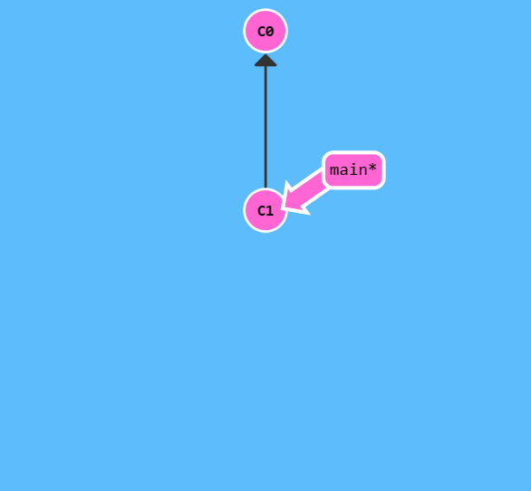
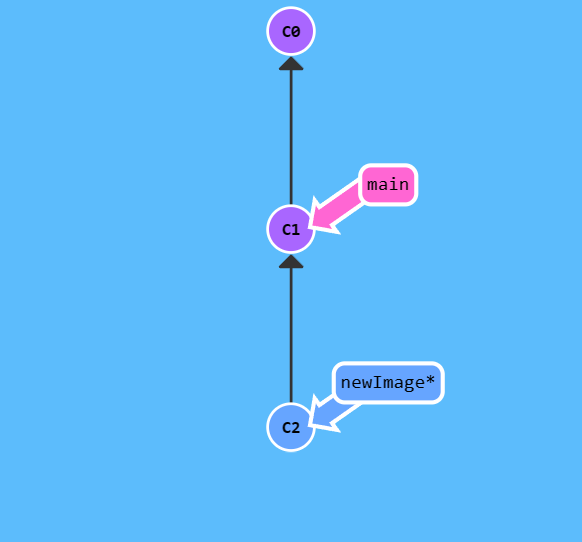
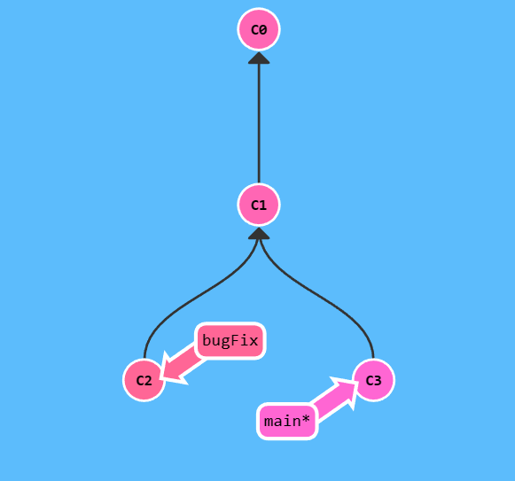
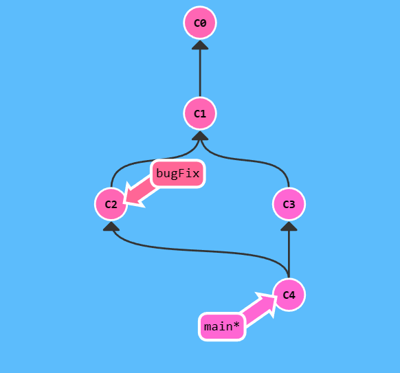
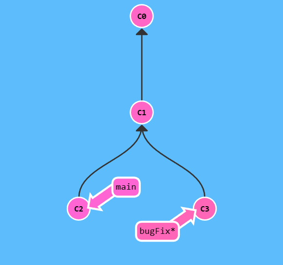
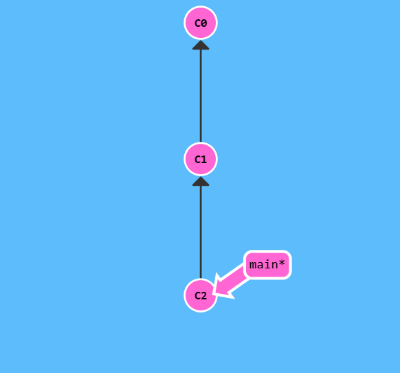
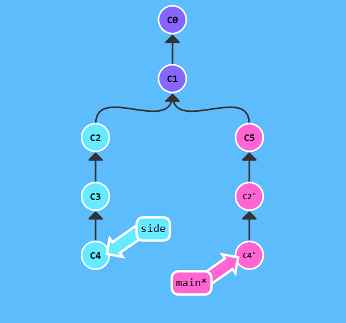

推荐先看[廖雪峰的教程](https://www.liaoxuefeng.com/wiki/896043488029600)，掌握基本的语句  
之后有需要再看[完整的参考书](https://git-scm.com/book/zh/v2)  


# *什么是 Git*

分布式的版本控制系统  
方便 **管理代码版本**，也可以帮助多人协作  

<div style="margin: 0px auto 20px auto; width: 80%; height: auto;">
    
</div>

上图中各个位置的含义  
Workspace：工作区  
Index / Stage：暂存区  
Repository：仓库区（或本地仓库）  
Remote：远程仓库  


# *Git 下载安装*

[下载地址](https://git-scm.com/downloads)  
[详细安装教程](https://blog.csdn.net/mukes/article/details/115693833)  


# *Git 的配置*

> 注意下面的语句都是在 Git Bash 上面执行的  

## 配置用户名和邮箱

```
git config --global user.name "YJJ"
git config --global user.email "1311906139@qq.com"
```
注意如果没有加上 `--global` 那就只是针对当前仓库，而不是所有仓库  

## 查看当前所有的配置信息

```
git config --list
```

## 设置彩色的 git 输出

```
git config color.ui true
```


# *常用命令*

## 初始化

- 切换到 D 盘  
    ```
    cd d:
    ```

- 创建一个新的文件夹 learngit  
    ```
    mkdir learngit
    ```

- 进入新建的文件夹  
    ```
    cd learngit
    ```

- 查看当前路径  
    ```
    pwd
    ```

- 切换到新的文件夹下，初始化一个 git 仓库，即图中的 Repository  
    ```
    git init
    ```

- 查看当前目录下的所有文件，应该有一个 .git 文件夹
    ```
    ls -ah
    ```

## 文件的提交

- 将文件添加到暂存区，即 Index/Stage  
    ```
    git add <文件名>
    ```

- 将文件提交到 Repository，`-m` 参数后的描述是为了便于理解提交内容  
    ```
    git commit -m "本次提交的相关描述"
    ```
    注意可以多次执行上面 `git add` 操作，最后再执行一次 `git commit`  

## 状态

- 查看本地仓库当前的状态，列出所有变更的文件  
    ```
    git status
    ```

## 差异

- 查看文件修改的地方  
    ```
    git diff 文件名
    ```

- 查看当前文件与本地仓库中的版本之间的不同之处  
    ```
    git diff HEAD -- 文件名
    ```

## 日志

- 查看提交的日志  
    ```
    git log
    ```
    进入日志后，下方显示冒号 `:` ，这时可以输入英文 `q` 退出  
    
- 美化日志输出信息
    由于 Git 中文件的索引不是文件名，而是 **一长串哈希值**，所以有时候查看日志界面很混乱，通过以下命令美化  
    ```
    git log --graph --pretty=oneline --abbrev-commit
    ```

- 查看某人的提交记录  
    ```
    git log --author=YJJ
    ```

## 版本回退

- 回退至上一个版本  
    ```
    git reset --hard HEAD^
    ```

- 回退至上两个版本  
    ```
    git reset --hard HEAD^^
    ```

- 回退至上 n 个版本  
    ```
    git reset --hard HEAD~n
    ```

- 回退至指定版本  
    ```
    git reset --hard 版本号
    ```
    版本号就是那一串哈希值，但不用写全，只取前几位就可以  

- 获取远程仓库上的最新版本，并将主分支 main 指向它  
    ```
    git reset --hard origin/main
    ```

## 历史

- 查看已执行的命令  
    ```
    git reflog
    ```
    可以用于查看版本号  

## 撤销修改

- 工作区的丢弃  
    ```
    git restore 文件名
    ```
    或者
    ```
    git checkout -- 文件名
    ```
    注意 `--` 很重要  
    该语句会使用本地仓库中最新内容替换当前工作区中的文件  

- 暂存区的丢弃  
    先撤销暂存区的：  
    ```
    git restore --staged 文件名
    ```
    再撤销工作区的：  
    ```
    git restore 文件名
    ```

## 删除

- 删除仓库  
    ```
    rm -rf .git
    ```

- 删除文件  
    ```
    git rm 文件名
    ```
    相当于
    ```
    rm 文件名
    git add 文件名
    ```

## 远程仓库

- 创建 SSH Key  
    先去 C:\Users\ 自己的 PC 用户名，看看是否存在 .ssh 这个文件夹，里面是否有 id_rsa 和 id_rsa.pub 这两个文件  
    如果没有，则执行下面的语句  
    ```
    ssh-keygen -t rsa -C "自己的邮箱"
    ```
    执行后一路回车，暂时不需要设置密码  

- 查看 id_rsa.pub 中的内容  
    ```
    cd ~/.ssh
    cat id_rsa.pub
    ```
    再自己手动复制一下内容  

- 设置 Github  
    注册好 Github 账号  
    登录后在 Settings 中找到 SSH 设置项中添加新的 SSH Key  
    设置任意 title，在 Key 文本框里粘贴 id_rsa.pub 文件的内容  

- 关联远程仓库  
    先在 Github 上面创建一个新的仓库，命名为 learngit，再执行  
    ```
    git remote add origin git@github.com:yjjyjya/learngit.git
    或者
    git remote add origin https://github.com/yjjyjya/ubuk.git
    ```

- 查看远程仓库信息  
    ```
    git remote -v
    ```

- 删除已关联的远程仓库  
    ```
    git remote rm origin
    ```

- 推送本地仓库的 main 分支到远程仓库
    ```
    git push -u origin main
    ```
    这里的 origin 是默认的，可以更改  
    
    > [!NOTE]
    > 注意第一次推送需要有个 -u  
    > Git 会把本地的 main 分支和远程的 main 分支 **关联起来**  
    > ，之后的推送或者拉取就可以简化命令 `git push origin main`  

- 将远程仓库的内容克隆到本地  
    ```
    git clone git@github.com:yjjyjya/learngit.git
    或者
    git clone https://github.com/yjjyjya/learngit.git
    ```

## 分支

主分支 main 主要用于主线代码的开发  
新建分支的目的：保证我们主分支继续执行的情况下，能够做一些其它的事情【比如bug修复或是难题攻克】  

- 查看当前的分支有哪些  
    ```
    git branch
    ```

- 创建分支，名为 dev  
    ```
    git branch dev
    ```

- 切换到分支 dev  
    ```
    git switch dev
    或者  
    git checkout -b dev
    ```

- 创建并切换到分支 dev  
    ```
    git switch -c dev
    ```

- 删除分支 dev  
    ```
    git branch -d dev
    ```
    需要 **强制删除** 时，将 `-d` 换成 `-D`  

- 将分支 dev 合并到当前分支  
    ```
    git merge dev
    ```
    有时候合并失败需要 **手动处理** 再合并

    - 禁用 fast forward 方法的合并  
        ```
        git merge --no-ff -m "merge with no-ff" dev
        ```

- 拉取远程分支的最新内容  
    ```
    git pull
    ```

- 将提交历史整理成直线  
    ```
    git rebase
    ```

## 标签

- 给某个提交创建带有说明的标签  
    用 `-a` 指定标签名，`-m` 指定说明文字  
    ```
    git tag -a 标签名 -m "标签的说明信息" 版本号
    ```

- 查看所有标签  
    ```
    git tag
    ```

- 查看标签信息  
    ```
    git show 标签名
    ```

- 删除本地的标签  
    ```
    git tag -d 标签名
    ```    

- 推送一个本地标签到远程仓库  
    ```
    git push origin 标签名

    # 一次性把所有标签推送到远程仓库
    git push origin --tags
    ```

- 删除一个远程标签  
    ```
    git push origin :refs/tags/标签名
    ```

## 紧急切换

- 将当前工作区的内容暂存起来且隐藏
    ```
    git stash
    ```

- 查看隐藏的内容
    ```
    git stash list
    ```

- 恢复隐藏的内容并删除 stash 的内容
    ```
    git stash pop
    ```

- 解决 bug 后，同步各分支的内容
    ```
    git cherry-pick 版本号
    ```

## 图形化

打开 Git GUI  
或者  
切换到仓库的路径下，执行 `gitk`  


# *可能遇到的问题*

- 1、[若想要 Git 忽略掉对某个文件的管理](https://cloud.tencent.com/developer/article/1124235#)  
    先删除已经托管的文件 `git rm -cached 某文件`  
    将该文件写入 .gitignore 文件中  
    然后 add 再 commit 再 push 到远程仓库即可  

- 2、`git push` 发生错误  
    可能本地仓库和远程仓库的 **文件有冲突**，要先 `pull` 远端的版本，解决了冲突才能 `push`  
    `git pull origin main / git pull origin main --allow-unrelated-histories` 先拉取合并到本地仓库  
    `git push -u origin main` 再推送上去  

    > [!NOTE]
    > 建议在新建仓库的时候，**不要勾选** README 和 .gitignore 选项，统一由本地生成，这样在建立关联关系的时候就不会有冲突了  

- 3、 .gitignore 文件的书写  
    .gitignore 文件一般放在代码库的根目录下，但是也可以在其他目录下，支持多个 .gitignore 文件  
    `#` 为注释  
    `\` 为转义字符，可以转义空格  
    `!` 使得文件重新添加进来，不 ignore  
    `/doc/frotz/` 只会匹配 `doc/frotz` 目录，而不会匹配 `a/doc/frotz` 目录  
    但是 `frotz/` 匹配 `frotz` 目录以及 `a/frotz` 目录，等价于 `**/frotz`
    所有路径都是相对 .gitignore 文件所在的路径  

    `*` 只能匹配文件和当前目录下的一级目录  
    `foo/*` 能匹配到 `foo/test.json`，`foo/bar`，但不能匹配到 `foo/bar/hello.c`，因为 `*` 匹配不到含有 `/` 的部分  

    `abc/**` 匹配目录 `abc` (相对于 .gitignore 的路径)下的所有文件  
    `a/**/b` 可以匹配 `a/b`、`a/x/b`、`a/x/y/b` 等等  


# *有趣的 Git 闯关练习*

https://learngitbranching.js.org/?locale=zh_CN  
展示答案 `show solution`  
选择关卡 `levels`  
重置 `reset`  

下面是关卡中常用的语句  

- `git commit`  
    <div style="margin: 0px auto 20px auto; width: 50%; height: auto;">
        
    </div>
    执行一次提交后，产生新的节点 c2  
    <div style="margin: 0px auto 20px auto; width: 50%; height: auto;">
        
    </div>

- `git branch newImage`   
    创建一个名为 newImage 分支  
    <div style="margin: 0px auto 20px auto; width: 50%; height: auto;">
        
    </div>

- `git checkout newImage; git commit`  
    切换到 newImage 分支并进行提交  
    <div style="margin: 0px auto 20px auto; width: 50%; height: auto;">
        
    </div>

- `git checkout -b bugFix`  
    创建并切换到 bugFix 分支  
    等同于：`git branch bugFix; git checkout bugFix`
    

- `git branch -f main C1`  
    强制让 main 分支指向 C1  
    <div style="margin: 0px auto 20px auto; width: 50%; height: auto;">
        
    </div>

    <div style="margin: 0px auto 20px auto; width: 50%; height: auto;">
        
    </div>
    

- `git checkout 哈希值`  
    绝对引用，切换到对应哈希值的提交上，**分离出 HEAD**  

- `git checkout main^` 等同于 `git checkout main~1`  
    相对引用，向上移动一个提交  
    让 HEAD 指向 main 的上一次提交  
    <div style="margin: 0px auto 20px auto; width: 50%; height: auto;">
        
    </div>

    `git checkout main~; git checkout main^2; git checkout main~2;`

    <div style="margin: 0px auto 20px auto; width: 50%; height: auto;">
        
    </div>

- `git checkout o/main`  
    切换到远程分支 o/main，若进行提交，则会变成 HEAD 分离状态，但是实际上 o/main 不会变化

- `git checkout -b feature C2; git push origin feature`  
    创建一个新的分支 feature 指向哈希值为 C2 的提交，再将本地的 feature 分支推送到远程

- `git checkout -b foo o/main`  
    设置新的分支 foo 跟踪远程仓库 o/main（原本是本地的main去跟踪）

- `git merge bugFix`  
    <div style="margin: 0px auto 20px auto; width: 50%; height: auto;">
        
    </div>
    将分支 bugFix 合并到当前分支上  
    <div style="margin: 0px auto 20px auto; width: 50%; height: auto;">
        
    </div>

- `git rebase main`  
    <div style="margin: 0px auto 20px auto; width: 50%; height: auto;">
        
    </div>
    使得提交记录清晰，将当前分支复制到 main 分支
    <div style="margin: 0px auto 20px auto; width: 50%; height: auto;">
        
    </div>

- `git rebase -i HEAD~4`  
    参数-i表示打开交互式的 rebase，在UI界面中可以调整提交的顺序，删除不想要的提交等等

- `git pull`  
    拉取并合并  
    `git pull = git fetch + git merge`

- `git pull --rebase`  
    也是拉取后合并，但是 rebase 的提交记录更加简洁

- `git push` 推送更新到远程仓库，若失败则可能是因为最新提交的 C3 基于远程分支中的 C1，而远程仓库中该分支已经更新到 C2 了。可以先 `git fetch; git rebase o/main; git push` 拉取最新的进行合并，再上传。但是若需要使得远程仓库也包含修改的分支，则使用 merge 而不是 rebase

- `git push origin foo`  
    推送更新远程的 foo 分支

- `git push origin foo^:main`  
    将本地的 foo 分支的父提交推送到远程的 main 分支上（支持重命名）；对应的 push 改成 fetch 也是同理的；冒号前后置空可以用来删除分支

- `cat .git/HEAD`  
    查看 HEAD 指向

- `git reset HEAD~1`  
    将当前分支回退到 HEAD~1，但是当前分支还在工作区中只是未 add 到暂存区中
    <div style="margin: 0px auto 20px auto; width: 50%; height: auto;">
        
    </div>
    <div style="margin: 0px auto 20px auto; width: 50%; height: auto;">
        
    </div>

- `git revert HEAD~1`  
    创建与 HEAD~1 相同的新提交，效果相当于撤回，远程分支也就能进行 “撤回” 操作

- `git cherry-pick 哈希值1 哈希值2`  
    将对应哈希值的提交复制到当前分支进行提交
    <div style="margin: 0px auto 20px auto; width: 50%; height: auto;">
        
    </div>
    
    `git cherry-pick C2 C4`
    
    <div style="margin: 0px auto 20px auto; width: 50%; height: auto;">
        
    </div>

- `git commit -amend`  
    把上一次的 commit 记录去除，修改 commit 信息

- `git tag v1 C1`  
    建立一个标签 v1，指向提交记录 C1

- `git describe C1`  
    查看提交的信息

- `^数字`  
    可以指定向上移动到某个父提交，`git branch 分支名` 后面也可以跟上 `^` 指定位置

- `git clone 远程仓库地址`  
    在本地创建一个远程仓库的拷贝

- `git fetch`  
    可以理解为单纯的下载远程仓库

- `git fakeTeamwork foo 3`  
    在远程仓库的 foo 分支上做三次提交


# *参考资料*

https://zhuanlan.zhihu.com/p/30044692  
https://blog.csdn.net/qq_34519487/article/details/107882290  