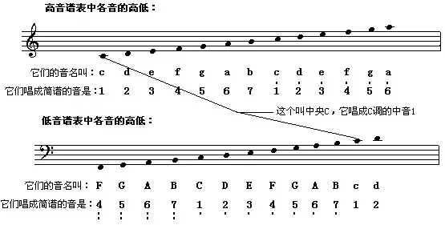
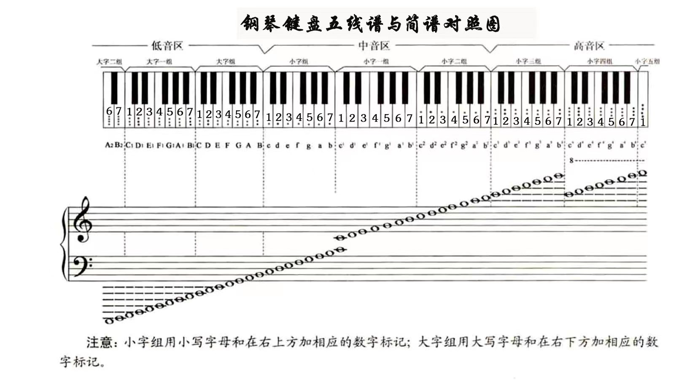
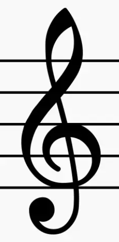
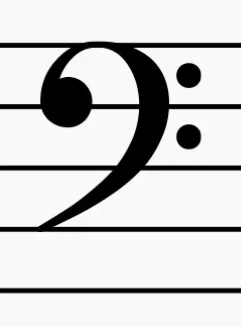
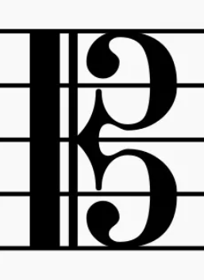
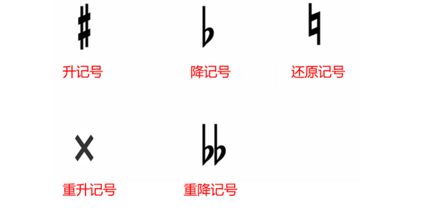

五线谱是记录音乐的语言  
五条平行线，线之间叫做【间】  

<div style="margin: 0px auto 20px auto; width: 80%; height: auto;">
    
</div>

- 高音谱表：【从下往上】分别叫做第一线，第二线，...，第五线  
第一线和第二线之间叫做第一间，以此类推  

- 低音谱表：注意是【从上往下】分别叫做第一线，第二线，...，第五线  
第一线和第二线之间叫做第一间，以此类推  

|  |  |  |  |  |  |  |  |
| --- | --- | --- | --- | --- |---  | --- | --- |
| 音名 | c | d | e | f | g | a | b |
| 简谱音 | 1 | 2 | 3 | 4 | 5 | 6 | 7 |
| 唱名 | do | re | mi | fa | sol | la | si |

C 到 D 是大 2 度（注意不是 1 度）  

<div style="margin: 0px auto 20px auto; width: 80%; height: auto;">
    
</div>

钢琴中每12个键（包括黑白键）叫做一组  
中央 c 位于小字一组  

- 高音谱号：也叫 G 谱号，记在五线谱的第二线上

    <div style=" width: 5%; height: auto;">
        
    </div>

    下加一线为中央 c
    
    ```
    -----------------------  f2(fa)
            e2(mi)
    -----------------------  d2(re)
            c2(do)
    -----------------------  b1(si)
            a1(la)
    -----------------------  g1(sol) 高音谱号标识的位置
            f1(fa)
    -----------------------  e1(mi)
    ```
    

- 低音谱号：也叫 F 谱号，因为它记在五线谱的第四线上

    <div style=" width: 5%; height: auto;">
        
    </div>

    上加一线为中央 c

    ```
    -----------------------  a(la)
            g(sol)
    -----------------------  f(fa) 低音谱号标识的位置
            e(mi)
    -----------------------  d(re)
            c(do)
    -----------------------  B(si)
            A(la)
    -----------------------  G(sol)
    ```

- 中音谱号：也叫 C 谱号，最中间的部分对准哪一条线，这条线上标出的音就唱 do

    <div style=" width: 5%; height: auto;">
        
    </div>

- 升降记号

    <div style=" width: 80%; height: auto;">
        
    </div>

    符号所在的行需要进行升调或者降调


| 音符名 | 时值（拍数） | 图片 |
| :--- | :---: | :---: |
| 全音符 | 4拍 |  |
| 二分音符 | 2拍 |  |
| 四分音符 | 1拍 |  |
| 八分音符 | 半拍 |  |
| 十六分音符 | 1/4 拍 |  |
| 三十二分音符 | 1/8 拍 |  |
| ...... |  |  |


# 好玩的

可以通过特定的markdown生成对应的谱子：https://markdown.lovejade.cn/?utm_sourece=markdown.lovejade.cn&pid=main-title  


# 参考资料

https://www.zhihu.com/question/25437178  
https://www.zhihu.com/question/277068980  