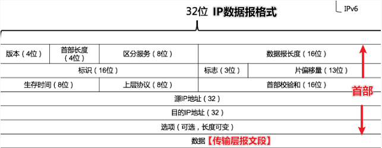
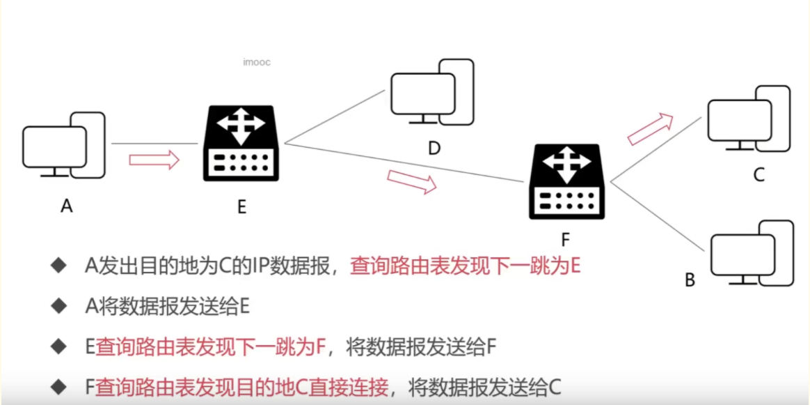
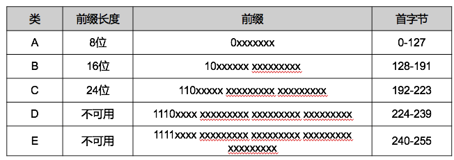
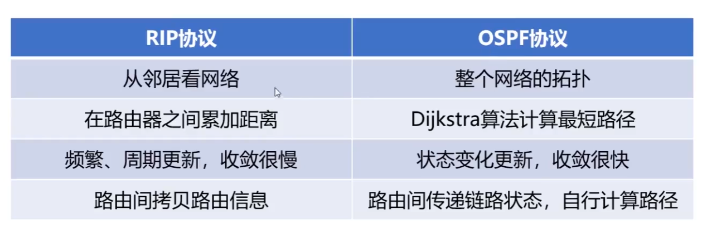
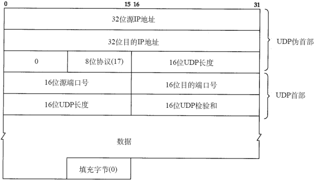
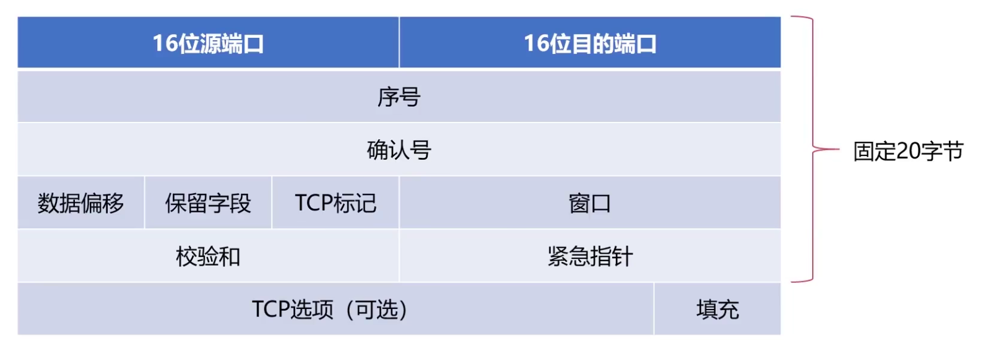
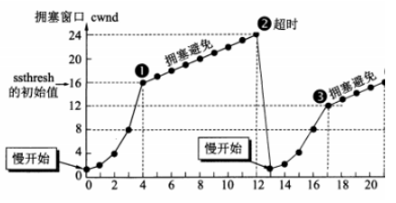
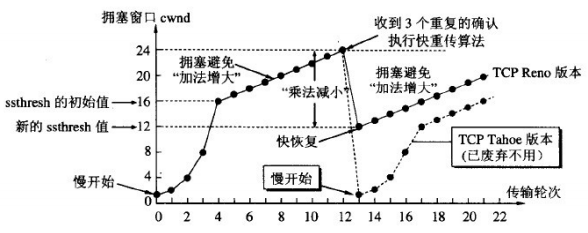

# *一、计算机网络概述*

## 1.1 计算机网络的分类

- 按照作用范围分类  
    1、广域网（WAN）  
    2、城域网（MAN）  
    3、局域网（LAN）  

- 按照网络使用者分类  
    1、公用网络  
    2、专用网络  

## 1.2 计算机网络的层次结构

7 层  
物理层，负责实现通信的光电物理特性  
数据链路层，负责相邻节点之间的数据通信  
网络层，数据路由，决定数据在网络中的路径  
传输层，负责端到端的网络通信  
会话层，负责建立、维护、重连通信会话  
表示层，负责数据处理，编码解码、加密解密  
应用层，负责提供接口和服务  

上述 7 层结构也叫 **OSI 体系结构**  
相应的有一个TCP/IP的 4 层模型，对比如下  

| OSI 七层网络模型 | TCP/IP 四层概念模型 | 基本数据单位 | 对应网络协议 |
| --- | --- | --- | --- |
| 应用层 | 应用层 | 数据报文 | HTTP、FTP 等 |
| 表示层 |  |  | Telnet |
| 会话层 |  |  | SMTP、DNS 等 |
| 传输层 | 传输层 | 段 | TCP、UDP 等 |
| 网络层 | 网络层 | 分组、IP 数据报 | IP、ICMP 等 |
| 数据链路层 | 网络接口层 | 数据帧、比特 | PPP 等 |
| 物理层 |  |  | IEEE 等 |

## 1.3 层次结构设计的基本原则

各层之间相互独立、完全解耦？？？  
每层需要一定的灵活性  

## 1.4 计算机网络的性能指标

速率，bps即bit/s，每秒多少比特（1字节=8比特=8位 / 1Byte=8bit）  
时延，包括：发送、传播、排队、处理4种时延  
往返时间RTT，数据报文在端到端通信中来回一次的时间  

# *二、物理层*

## 2.1 作用

连接不同的物理设备，传输比特流  
该层为上层协议提供了一个传输数据的可靠的物理媒体  
确保原始的数据可在各种物理媒体上传输  

## 2.2 设备

- 中继器（Repeater，也叫放大器）  
    同一局域网的再生信号  
    两端口的网段必须同一协议  

- 集线器  
    同一局域网的再生、放大信号（可看作多端口的中继器）  
    半双工，不能隔离冲突域也不能隔离广播域  

- 信道  
    是往一个方向传输信息的媒体，一条通信电路包含一个发送信道和一个接受信道  
    
    - 通信信道类别  
        
        - 单工：只能一个方向通信，没有反方向反馈的信道
        
        - 半双工：双方都可以发送和接受信息，但不能同时发送也不能同时接收
        
        - 全双工：双方都可以同时发送和接收

# *三、数据链路层*

## 3.1 概述

数据链路层是第 2 层，在第 1 层物理层提供的服务的基础上，向第 3 层网络层提供服务  
**数据链路层在不可靠的物理介质上为网络层提供可靠的传输**  

- 作用  
    物理地址寻址  
    数据的成帧  
    流量控制  
    数据的检错  
    重发  

- 基本数据单位为帧  
    
    - 封装成帧  
        数据前后加上首部和尾部，它们是特定的控制字符  
    
    - 透明传输  
        特定的控制字符若出现在了数据内部而不是首尾部怎么办？  
        没事，透明传输机制会在控制字符前面加上转义字符  

- 主要协议：以太网协议  

- 重要设备  
    网桥  
    交换机  

## 3.2 差错检测

- 方法  
    
    - 奇偶校验码  
        当出错两位时，检测不到错误  
    
    - 循环冗余校验码CRC  
        根据传输或保存的数据而产生固定位数校验码  

具体检测过程省略

## 3.3 最大传输单元 MTU

数据帧的长度受到MTU的限制，并不是无限大的  

## 3.4 以太网协议

- 以太网协议  
    一种局域网技术，应用于数据链路层  
    用于完成相邻设备的数据帧传输  
    
- 以太网的特点  
    数据速率快  
    硬件价格便宜，网络造价成本低  

- 以太网帧结构  

| 结构 | 占用字节数 |
| --- | --- |
| 目的地址（MAC地址） | 6 字节 |
| 源地址（MAC地址） | 6 字节 |
| 类型（标识上层协议） | 2 字节 |
| 帧数据（封装的上层协议的分组） | 46 ~ 1500 字节 |
| CRC（循环冗余码） | 4 字节 |

所以，以太网帧最短为 64 字节（以太网帧除了数据部分 6+6+2+4=18 字节，数据最短 46 字节）  

- MAC 地址  
    也叫物理地址或者局域网地址  
    每一个设备都拥有唯一的 MAC 地址，比如你的计算机或者手机都是如此  
    共 48 位 == 6 字节  
    通常采用十六进制表示法，每个字节表示一个十六进制数，用 - 或 : 连接起来  
    MAC 广播地址：FF-FF-FF-FF-FF-FF  

# *四、网络层*

- 具体功能  
    寻址和路由选择  
    连接的建立、保持和终止等  

数据交换技术是报文交换（基本上被分组所替代）：采用储存转发方式  

## 4.1 IP协议

- 虚拟互联网络的产生  
    实际的计算机网络错综复杂  
    物理设备通过使用 IP 协议，屏蔽了物理网络之间的差异  
    当网络中主机使用 IP 协议连接时，无需关注网络细节  

    可以想象成IP协议构成了计算机之间通信的黑盒子

- IP协议  
    **是TCP/IP的核心协议**  
    仅仅提供不可靠、无连接的传送服务  
    与IP协议配套使用实现其功能的还有地址解析协议ARP、逆地址解析协议RARP、因特网报文协议ICMP、因特网组管理协议IGMP  
    
    - 主要功能  
        无连接数据报传输  
        数据报的路由选择  
        差错控制  

    

        
    

    其中，版本指IP协议的版本，占4位，如IPv4和IPv6；首部位长度表示IP首部长度，占4位；IP数据报总长度，占16位，最大数值位2^16=65535；生存时间表示IP数据报文在网络中的寿命，占8位；上层协议表明IP数据所携带的具体数据是什么协议的，如TCP、UDP  
    
## 4.2 IP 协议的转发流程

    

通过查询路由表来发现下一跳  

## 4.3 IP 地址的子网划分

总长度位 32 位，即 4 字节

| \ | A类 | B类 | C类 | D类 | E类 |
| --- | --- | --- | --- | --- | --- |
| 构成 | 8网络号   +   24主机号 | 16网络号   +   16主机号 | 24网络号   +   8主机号 |  |  |
| 用途 |  |  | 用于标识网络中的主机或路由器 | 作为组广播地址 | 地址保留 |

    

| \ | A类 | B类 | C类 |
| --- | --- | --- | --- |
| 前缀长度 | 8位 | 16位 | 24位 |
| 前缀 | 0xxxxxxx | 10xxxxxx.xxxxxxxx | 110xxxxx.xxxxxxxx.xxxxxxxx |
| 最小网络号 | 0   (00000000) | 128.0   (10000000.00000000) | 192.0.0   (11000000.00000000.00000000) |
| 最大网络号 | 127   (01111111) | 191.255   (10111111.11111111) | 223.255.255   (11011111.11111111.11111111) |
| 子网数量 | 2^7 | 2^14 | 2^21 |
| 最小主机号 | 0.0.0 | 0.0 | 0 |
| 最大主机号 | 255.255.255 | 255.255 | 255 |
| 主机数量 | 2^24 | 2^16 | 2^8 |

## 4.4 网络地址转 NAT 技术

用于多个主机通过一个公有IP访问互联网的私有网络  
减缓了IP地址的消耗，但是增加了网络通信的复杂度  

- NAT 工作原理（作IP地址替换）  
    从内网出去的IP数据报，将其IP地址替换为NAT服务器拥有的合法的公共IP地址，并将替换关系记录到NAT转换表中  
    从公共互联网返回的IP数据报，依据其目的的IP地址检索NAT转换表，并利用检索到的内部私有IP地址替换目的IP地址，然后将IP数据报转发到内部网络  
    
用自己的话来说就是：**通过NAT转换表，发出去时候私有IP转换成公共IP，收进来的时候目的IP转换成私有IP**  

## 4.5 ARP 协议与 RARP 协议

- ARP（Address Resolution Protocol）地址解析协议  
    为网卡（网络适配器）的IP地址到对应的硬件地址提供动态映射  
    可以把 **网络层32位地址** ---> **数据链路层MAC48位地址**  
    即插即用，一个ARP表是自动建立的，不需要系统管理员来配置  

- RARP（Reverse Address Resolution Protocol）逆地址解析协议  
    是 ARP 的逆过程  
    可以把 **数据链路层MAC48位地址** ---> **网络层32位地址**  

## 4.6 ICMP 协议

ICMP（Internet Control Message Protocol）网际控制报文协议  
可以报告 **错误信息或者异常情况**，ICMP报文封装在IP数据报当中  

    

- 应用  
    Ping：网络故障的排查  
    Traceroute：可以探测IP数据报在网络中走过的路径  

## 4.7 网络层的路由

- 路由算法的要求  
    正确的完整的  
    在计算上应该尽可能是简单的  
    可以适应网络中的变化  
    稳定的公平的  

- 自治系统AS  
    指处于一个管理机构下的网络设备群  
    AS内部网络自治管理，对外提供一个或多个出入口  
    其中自治系统内部的路由协议为内部网关协议，如RIP、OSPF等；自治系统外部的路由协议为外部网关协议，如BGP  

- 静态路由：人工配置，难度和复杂度高  

- 动态路由  
    1、【链路状态】路由选择算法 LS  
    向所有隔壁路由发送信息收敛快；全局式路由选择算法，每个路由器计算路由时，需构建整个网络拓扑图；利用 **Dijkstra算法** 求源端到目的端网络的最短路径  
    2、【距离-向量】路由选择算法 DV  
    向所有隔壁路由发送信息收敛慢、会存在回路；基础是 **Bellman-Ford 方程**（简称B-F方程）  
    
## 4.8 内、外部网关协议

内部  

- RIP（Routing Information Protocol）路由信息协议  
    位于 **应用层**  
    基于距离-向量的路由选择算法，较小的AS（自治系统），适合小型网络  
    报文封装进 UDP 数据报  
    
    - 特性  
        采用跳数来度量路径（每个路由器维护自身到其他每个路由器的距离记录）  
        费用定义在源路由器和目的子网之间  
        网络直径被限制为不超过15跳  
        和隔壁交换所有的信息，30主动一次（广播）  

- OSPF（Open Shortest Path First）开放最短路径优先协议  
    位于 **网络层**  
    基于链路状态的路由选择算法（即Dijkstra算法），较大规模的AS，适合大型网络  
    报文直接封装在IP数据报  
    
    - 优点  
        安全  
        支持多条相同费用路径  
        支持区别化费用度量  
        支持单播路由和多播路由  
        分层路由  

    

外部  

- BGP（Border Gateway Protocol）边际网关协议  
    位于 **应用层**  
    是运行在AS之间的一种协议，寻找一条好路由。首次交换全部信息，以后只交换变化的部分  
    BGP封装进TCP报文段  

# *五、传输层*

第一个端到端，即主机到主机的层次

- 传输层的任务  
    根据通信子网的特性，最佳的利用网络资源，为两个端系统的会话层之间，提供建立、维护和取消传输连接的功能，负责端到端的可靠数据传输  
    处理端到端的差错控制和流量控制问题  

在这一层，信息传送的协议数据单元称为段或报文  

网络层只是根据网络地址将源结点发出的数据包传送到目的结点  
而传输层则负责将数据可靠地传送到 **相应的端口**  

- 主要协议
    
    - TCP协议（Transmission Control Protocol）传输控制协议
    
    - UDP协议（User Datagram Protocol）用户数据报协议

- 重要设备：网关

使用不同的端口来标记不同的网络进程，其中端口 port 使用 16 比特位表示，故端口可能的范围为 [0, 65535]  

- 常见协议占用的端口  

| FTP | HTTP | HTTPS | DNS | TELNET |
| --- | --- | --- | --- | --- |
| 21 | 80 | 443 | 53 | 23 |

## 5.1 UDP协议

UDP首部 + UDP数据报 = IP数据报的数据部分

- 特点  
    无连接协议  
    不能保证可靠的交付数据  
    面向报文传输的  
    没有拥塞控制  
    首部开销很小  

    

首部：8字节=64位，源端口、目的端口、UDP长度、校验和各16位
数据字段：应用数据

## 5.2 TCP协议

TCP首部 + TCP数据报 = IP数据报的数据部分

- 功能  
    对应用层报文进行分段和重组  
    面向应用层实现复用与分解  
    实现端到端的流量控制  
    拥塞控制  
    传输层寻址  
    对收到的报文进行差错检测（首部和数据部分都检错）  
    实现进程间的端到端可靠数据传输控制  

- 特点  
    面向连接的协议  
    面向字节流的协议  
    一个连接有两端，即点对点通信  
    提供可靠的传输服务  
    提供全双工通信（每条TCP连接只能一对一）  

    

| TCP标记 | 含义 |
| --- | --- |
| URG | Urgent，紧急位，紧急数据 |
| ACK | Acknowlegement，确认位，使得确认号生效 |
| PSH | Push，推送位，把数据交付给应用层 |
| SYN | Synchronization，同步位，发送连接请求 |
| FIN | Finish，终止位，释放连接 |
| RST | Reset，重置位，重新建立连接 |

## 5.3 可靠传输

不可靠传输信道在数据传输中可能发生的情况：比特差错、乱序、重传、丢失  

- 基于不可靠信道实现可靠数据传输采取的措施  
    差错检测：利用 **编码** 实现数据包传输过程中的比特差错检测  
    确认：接收方 向 发送方 **反馈** 接收状态  
    重传：发送方 **重新发送** 接收方没有正确接收的数据  
    序号：确保数据 **按序** 提交  
    计时器：解决数据丢失问题  

- 可靠传输协议
    
    - 停止等待协议  
        是最简单的一种，但是该协议对信道的利用率不高  
    
    - 连续ARQ（Automatic Repeat reQuest）自动重传请求  
        滑动窗口+累计确认，大幅提高了信道的利用率  
        但是在某些情况下，重传的效率并不高，会重复传输部分已经成功接收的字节  
        TCP协议使用滑动窗口实现流量控制，让发送方发送速率不要太快  

## 5.4 拥塞控制

| \ | 流量控制 | 拥塞控制 |
| --- | --- | --- |
| 范围 | 点对点的通信量 | 考虑整个网络，全局性 |
| 使用到的方法 | 滑动窗口 | 慢启动+拥塞避免算法 |

- 慢开始、拥塞避免  
    【慢开始】拥塞窗口从1指数增长  
    到达阈值时进入【拥塞避免】，变成+1增长  
    【超时】，阈值变为当前拥塞窗口cwnd的一半（不能<2）  
    再从【慢开始】，拥塞窗口从1指数增长，依此类推  
    
    

        
    

- 快重传、快恢复  
    发送方连续收到3个冗余ACK，执行【快重传】，不必等计时器超时  
    执行【快恢复】，阈值变为当前cwnd的一半（不能<2），并从此新的ssthresh点进入【拥塞避免】  

    

        
    

## 5.5 TCP连接的握手

- 三次  
    
    - 为什么需要三次握手？  
        第一次握手：客户发送请求，此时服务器知道客户能发  
        第二次握手：服务器发送确认，此时客户知道服务器能发能收  
        第三次握手：客户发送确认，此时服务器知道客户能收  
    
    - 握手过程
        第一次：客户向服务器发送连接请求段，建立连接请求控制段（SYN=1），表示传输的报文段的第一个数据字节的序列号是x，此序列号代表整个报文段的序号（seq=x）；客户端进入 SYN_SEND （同步发送状态）  
        第二次：服务器发回确认报文段，同意建立新连接的确认段（SYN=1），确认序号字段有效（ACK=1），服务器告诉客户端报文段序号是y（seq=y），表示服务器已经收到客户端序号为x的报文段，准备接受客户端序列号为x+1的报文段（ack_seq=x+1）；服务器由LISTEN进入SYN_RCVD （同步收到状态）  
        第三次:客户对服务器的同一连接进行确认.确认序号字段有效(ACK=1),客户此次的报文段的序列号是x+1(seq=x+1),客户期望接受服务器序列号为y+1的报文段(ack_seq=y+1);当客户发送ack时，客户端进入ESTABLISHED 状态;当服务收到客户发送的ack后，也进入ESTABLISHED状态;第三次握手可携带数据  
    
    

        
    

- 四次  
    
    - 握手过程  
        第一次：客户向服务器发送释放连接报文段，发送端数据发送完毕，请求释放连接（FIN=1），传输的第一个数据字节的序号是x（seq=x）；客户端状态由ESTABLISHED进入FIN_WAIT_1（终止等待1状态）  
        第二次：服务器向客户发送确认段，确认字号段有效（ACK=1），服务器传输的数据序号是y（seq=y），服务器期望接收客户数据序号为x+1（ack_seq=x+1）;服务器状态由ESTABLISHED进入CLOSE_WAIT（关闭等待）； 客户端收到ACK段后，由FIN_WAIT_1进入FIN_WAIT_2  
        第三次:服务器向客户发送释放连接报文段，请求释放连接（FIN=1），确认字号段有效（ACK=1），表示服务器期望接收客户数据序号为x+1（ack_seq=x+1）;表示自己传输的第一个字节序号是y+1（seq=y+1）；服务器状态由CLOSE_WAIT 进入 LAST_ACK （最后确认状态）  
        第四次：客户向服务器发送确认段，确认字号段有效（ACK=1），表示客户传输的数据序号是x+1（seq=x+1），表示客户期望接收服务器数据序号为y+1+1（ack_seq=y+1+1）；客户端状态由FIN_WAIT_2进入TIME_WAIT，等待2MSL时间，进入CLOSED状态；服务器在收到最后一次ACK后，由LAST_ACK进入CLOSED  
    
    

        
    

    
    - 为什么客户机发送方需要在最后等待 2 个MSL（Max Sagment Lifetime）？  
        最后还有报文需要确定  
        确保最后的ACK可以送达  
        确保当前连接的所有报文都已过期  

# *六、应用层*

为操作系统或网络应用程序提供 **访问网络服务** 的接口  
数据传输基本单位为报文  

- 主要协议  
    FTP（文件传送协议）  
    Telnet（远程登录协议）  
    DNS（域名解析协议）  
    SMTP（邮件传送协议）  
    POP3协议（邮局协议）  
    HTTP协议（Hyper Text Transfer Protocol）  

## 6.1 DNS

Domain Name System，域名系统  
C/S，UDP，端口53  
解决IP地址复杂难以记忆的问题，存储并完成自己所管辖范围内主机的 **域名** 到 **IP 地址**的映射。IP —> DNS服务 —> 便于记忆的域名  

- 域名  
    由点、字母和数字组成，分为顶级域（com，cn，net，gov，org）、二级域（baidu,taobao,qq,alibaba）、三级域（www）(12-2-0852)  

- 域名解析的顺序  
    浏览器缓存  
    找本机的hosts文件  
    路由缓存  
    找DNS服务器（本地域名、顶级域名、根域名）->迭代解析、递归查询  

## 6.2 DHCP协议

Dynamic Configuration Protocol，动态主机设置协议  
局域网协议，是应用UDP协议的应用层协议  
作用：为临时接入局域网的用户自动分配IP地址  

## 6.3 FTP协议

文件传输协议  
控制连接（端口21）  
传输控制信息（连接、传输请求），以7位ASCII码的格式。整个会话期间一直打开  

## 6.4 HTTP协议

HyperText Transfer Protocol，超文本传输协议  
TCP，端口80  
可靠的数据传输协议，浏览器向服务器发收报文前，先建立TCP连接，HTTP使用TCP连接方式（HTTP自身无连接）  

- HTTP请求报文方式  
    GET：请求指定的页面信息，并返回实体主体  
    POST：向指定资源提交数据进行处理请求  
    DELETE：请求服务器删除指定的页面  
    HEAD：请求读取URL标识的信息的首部，只返回报文头  
    OPETION：请求一些选项的信息  
    PUT：在指明的URL下存储一个文档  
    
| 操作方式 | 数据位置 | 明文密文 | 数据安全 | 长度限制 | 应用场景 |
| --- | --- | --- | --- | --- | --- |
| GET | HTTP包头 | 明文 | 不安全 | 长度较小 | 查询数据 |
| POST | HTTP正文 | 可明可密 | 安全 | 支持较大数据传输 | 修改数据 |

- 存储器层次结构  
    缓存，Redis  
    主存，Memcached  
    辅存，内存SSD  

## 6.5 HTTPS协议

HTTPS(Secure)是安全的HTTP协议，端口号443  
基于HTTP协议，通过SSL或TLS提供加密处理数据、验证对方身份以及数据完整性保护  

# *参考资料*

https://blog.csdn.net/Royalic/article/details/119985591  