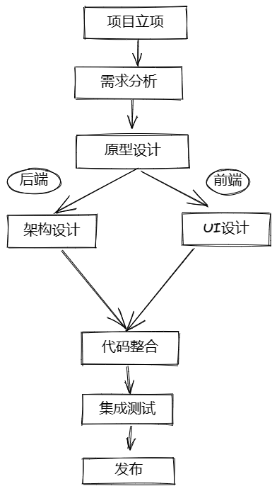
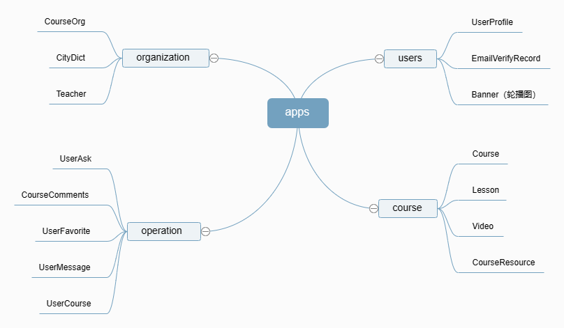

<div class="container" style="text-align: center;">
    <div class="note">
        <span class="title1">✨参考资料</span> 
    </div>
</div>

https://zhuanlan.zhihu.com/p/98788776  
https://www.cnblogs.com/RioTian/p/13828548.html  

---

<div class="container" style="text-align: center;">
    <div class="note">
        <span class="title1">✨Django 实现个人博客</span> 
    </div>
</div>

### ⭕ 设计一个应用的大致流程

<div class="img_container" style="margin: 0px auto 20px auto; width: 40%; height: auto;">
    
<!-- 前两个参数 h-shadow和v-shadow表示阴影在水平和垂直方向上产生的偏移，模拟光照的方向 -->
<!-- 第三个参数 blur设置为10px，表示阴影的模糊半径为10px，使阴影产生一定的模糊效果。 -->
<!-- color设置为rgba(0, 0, 0, 0.5)，表示阴影的颜色为黑色（RGB为0, 0, 0），透明度为0.5，即半透明的黑色阴影。 -->
</div>

### ⭕ 数据库设计

<div class="img_container" style="margin: 0px auto 20px auto; width: 90%; height: auto;">
    
</div>

### ⭕ 下载安装 miniconda  

1、测试是否安装成功  
`conda --version`  

2、设置镜像源  
```
conda config --add channels https://mirrors.tuna.tsinghua.edu.cn/anaconda/pkgs/free/
conda config --add channels https://mirrors.tuna.tsinghua.edu.cn/anaconda/pkgs/main/
conda config --set show_channel_urls yes
```

3、创建一个虚拟环境用于学习 django 项目  
`conda create -n djangoproj`  
`conda info --envs`  

> [!NOTE|style:flat]
> 激活某个虚拟环境 `conda activate 。。。`  
> 退出当前虚拟环境 `conda deactivate`  
> 删除某个虚拟环境 `conda env remove -n 。。。`  

### ⭕ 配置所需环境

`conda activate djangoproj`  
`conda install django==3.2, pillow, pymysql, markdown`  
还需要安装 MySQL 5.7.x  
进入 MySQL 创建一下需要的数据库，下面创建一个 my_blog 数据库
``` sql
create database my_blog;
show databases;
```

### ⭕ 具体实现步骤

#### 🔘 创建工程  

在合适的路径下，例如：D:\pyproj\DjangoLearn 下执行  
`django-admin startproject website`  
创建一个名叫 website 的工程  

#### 🔘 创建 app  

来到 D:\pyproj\DjangoLearn\website 下执行  
`python manage.py startapp blog`  
创建 blog app  

打开 D:\pyproj\DjangoLearn\website\website\settings.py  
修改如下参数，使得页面为中文  

``` python
LANGUAGE_CODE = 'zh-hans'

TIME_ZONE = 'Asia/Shanghai'

USE_I18N = True

USE_L10N = True

USE_TZ = False
```

再配置后端数据库为 MySQL

``` python
import pymysql
pymysql.install_as_MySQLdb()

。。。。。。

DATABASES = {
    'default': {
        'ENGINE': 'django.db.backends.mysql',
        'NAME': 'my_blog',      #数据库名字
        'USER': 'root',         #账号
        'PASSWORD': '123456',   #密码
        'HOST': '127.0.0.1',    #IP
        'PORT': '3306',         #端口
    }
}
```

> [!NOTE|style:flat]
> 注意在 runserver 前要先启动 MySQL 服务  

#### 🔘 模型设计

打开 D:\pyproj\DjangoLearn\website\blog\models.py，添加

``` python
from django.db import models
from django.contrib.auth.models import User

class Category(models.Model):
    name = models.CharField('分类',max_length=128)

    def __str__(self):
        return self.name

    class Meta:
        verbose_name = '博客分类'
        verbose_name_plural = verbose_name


class Tag(models.Model):
    name = models.CharField('标签', max_length=128)

    def __str__(self):
        return self.name

    class Meta:
        verbose_name = '博客标签'
        verbose_name_plural = verbose_name


class Entry(models.Model):
    title = models.CharField('文章标题',max_length=128)
    author = models.ForeignKey(User,verbose_name='作者',on_delete=models.CASCADE)
    img = models.ImageField(upload_to='blog_img',null=True,blank=True,verbose_name='博客配图')
    body = models.TextField('正文',)
    abstract = models.TextField('摘要',max_length=256,null=True,blank=True)
    visiting = models.PositiveIntegerField('访问量',default=0)
    category = models.ManyToManyField('Category',verbose_name='博客分类')
    tags = models.ManyToManyField('Tag',verbose_name='标签')
    created_time = models.DateTimeField('创建时间',auto_now_add=True)
    modifyed_time = models.DateTimeField('修改时间',auto_now=True)

    def __str__(self):
        return self.title

    class Meta:
        ordering = ['-created_time']
        verbose_name = '博客正文'
        verbose_name_plural = verbose_name
```

打开 D:\pyproj\DjangoLearn\website\blog\admin.py，添加

``` python
from django.contrib import admin
from . import models

class EntryAdmin(admin.ModelAdmin):
    list_display = ['title','author','visiting','created_time','modifyed_time']


# 将模型注册到 admin 后台管理系统中，方便数据录入
admin.site.register(models.Category)
admin.site.register(models.Tag)
admin.site.register(models.Entry,EntryAdmin)
```

在 terminal 执行以下命令，创建 admin 的超级用户  
`python manage.py createsuperuser`  

自行在 admin 后台添加一些 blog 的类别、标签、正文等，后面可以做测试用  

#### 🔘 url 和视图设计

打开 D:\pyproj\DjangoLearn\website\website\urls.py，添加

``` python
from django.contrib import admin
from django.urls import path, include

urlpatterns = [
    path('admin/', admin.site.urls),
    # 将 blog app 下的 url 进行导入
    path('blog/', include('blog.urls')),
]
```

打开 D:\pyproj\DjangoLearn\website\blog\urls.py，添加

``` python
from django.urls import path
from . import views

app_name = 'blog'    #设置这个之后，下面的 url 均会以 blog 开头
urlpatterns = [
    path('', views.index, name='blog_index'),    #例如若需要访问主页，url 为 localhost:8000/blog
    path('<int:blog_id>/', views.detail, name='blog_detail'),    #若要访问具体id为111的博客详情页，url 为 localhost:8000/blog/111
]
```

打开 D:\pyproj\DjangoLearn\website\blog\views.py，添加

``` python
from django.shortcuts import render

def index(request):
    return render(request,'blog/index.html',locals())
    # locals() 用于将参数传入 html 页面中


def detail(request,blog_id):
    return render(request,'blog/detail.html',locals())
```

创建文件夹 D:\pyproj\DjangoLearn\website\blog\templates\blog  
在该文件夹下创建 index.html  

``` html
<!DOCTYPE html>
<html lang="en">
    <head>
        <meta charset="UTF-8">
        <title>首页</title>
    </head>
    <body>
        <h1>博客首页</h1>
    </body>
</html>
```

在该文件夹中创建 detail.html

``` html
<!DOCTYPE html>
<html lang="en">
    <head>
        <meta charset="UTF-8">
        <title>博客详情页</title>
    </head>
    <body>
        <h1>博客｛｛ blog_id ｝｝的详情</h1>
    </body>
</html>
```

在 terminal 执行 `python manage.py runserver`  

> [!NOTE|style:flat]
> 为什么需要创建这么深的子文件夹，请看后续的参考资料  

### ⭕ 前端页面设计

创建文件夹 D:\pyproj\DjangoLearn\website\static  
下载 bootstrap、jquery 到其中  

创建文件夹 D:\pyproj\DjangoLearn\website\blog\static  

打开 D:\pyproj\DjangoLearn\website\website\settings.py，配置静态文件位置  

``` python
STATIC_URL = '/static/'
STATICFILES_DIRS = [
    os.path.join(BASE_DIR, 'static'),
    os.path.join(BASE_DIR, 'blog/static'),
]
```

编写 blog 的 base.html 页面

%accordion% 点击查看 base.html 的详细内容 %accordion%

注意在文件顶部添加 `load static`，放在大括号 `｛` 和百分号 `%` 之间  

``` html

<!DOCTYPE html>
<html lang="zh-CN">
<head>
    <meta charset="utf-8">
    <title>｛% block title %｝｛% endblock %｝</title>

    <link href="｛% static 'bootstrap-3.3.7-dist/css/bootstrap.min.css' %｝" rel="stylesheet">
    <link href="｛% static 'blog/css/blog_nav.css' %｝" rel="stylesheet">
    ｛% block css %｝｛% endblock %｝

</head>
<body>

<nav class="navbar navbar-fixed-top">
<div class="container-fluid">
    <!-- Brand and toggle get grouped for better mobile display -->
    <div class="navbar-header">
    <button type="button" class="navbar-toggle collapsed" data-toggle="collapse" data-target="#my-nav" aria-expanded="false">
        <span class="sr-only">Toggle navigation</span>
        <span class="icon-bar"></span>
        <span class="icon-bar"></span>
        <span class="icon-bar"></span>
    </button>
    <a class="navbar-brand" href="#">Zhang_derek</a>
    </div>

    <!-- Collect the nav links, forms, and other content for toggling -->
    <div class="collapse navbar-collapse" id="my-nav">
    <ul class="nav navbar-nav">
        <li class="active"><a href="/blog/">博客</a></li>
        <li ><a href="#">学习资源</a></li>
        <li ><a href="#">联系我</a></li>
    </ul>

    <form class="navbar-form navbar-left">
        <div class="form-group">
        <input type="text" class="form-control" placeholder="Search">
        </div>
        <button type="submit" class="btn btn-default">搜索</button>
    </form>

    <ul class="nav navbar-nav navbar-right">
        <li><a href="#">登录</a></li>
    </ul>

    </div><!-- /.navbar-collapse -->
</div><!-- /.container-fluid -->
</nav>

｛% block content %｝｛% endblock %｝

<footer>
    <div class="footer" role="navigation">
        <div class="container">
            <div class="navbar-text">
                <ul class="footer-text">
                    <li><a href="#">主页</a></li>
                            <li><a href="#">联系我们</a></li>
                            <li><a href="#">关于博主</a></li>
                            <li><a href="#">文档支持</a></li>
                            <li><a href="/blog/">博客首页</a></li>
                </ul>
                <p>Copyright © 2018 Zhang_derek </p>

            </div>
        </div>
    </div>
</footer>


<script src="｛% static 'jquery-3.2.1.min.js' %｝"></script>
<script src="｛% static 'bootstrap-3.3.7-dist/js/bootstrap.min.js' %｝"></script>

｛% block script %｝｛% endblock %｝

</body>
</html>
```

%/accordion%

编写 blog 的 index.html 页面，通过复用 base.html 实现快速的扩展

%accordion% 点击查看 index.html 的详细内容 %accordion%

``` html
｛% extends 'blog/base.html' %｝

｛% block title %｝博客首页｛% endblock %｝

｛% block content %｝

    博客首页
    <div style="height: 440px; " ></div>

｛% endblock %｝
```

%/accordion%

创建 D:\pyproj\DjangoLearn\website\blog\static\blog\css\blog_nav.css  

%accordion% 点击查看 blog_nav.css 的详细内容 %accordion%

``` css
body {
    margin-top: 30px;
    font-weight: 400;
    /* Required padding for .navbar-fixed-top. Change if height of navigation changes. */
    padding-top: 70px;
}

/* Navbar and footer (global) styling */
.navbar-fixed-top .nav {
    padding: 15px 0;
}

.navbar {
    color: black;
    border-width: thin;
    -webkit-transition: .2s;
    background-color: white;
    border-bottom: 1px solid #e0e0e0;
    background-color: white;
}

.navbar a {
    color: black;
}

.navbar-fixed-top .navbar-brand {
    padding: 0 15px;
}

.navbar-header .icon-bar {
    background-color: black;
}

.navbar-nav > li > .navbar-active {
    color: #E46E2E;
}

.navbar-scroll {
  background-color: white;
    animation-duration: 2s;
    animation-name: smooth;
    -moz-box-shadow: 1px 1px 1px #999;
    -webkit-box-shadow: 1px 1px 1px #999;
    box-shadow: 1px 1px 1px #999;
}

.jupytercon-nav > li > .black-tab {
    color: black;
}

.navbar-logo {
    height: 45px;
}

.nav > li > a {
    font-size: 20px;
    padding: 12px 16px 10px;
}

.nav > li > a:hover {
    background-color: transparent;
    color: #E46E2E;
    -webkit-transition: .2s;
}

.nav > li > a:focus {
    background-color: white;
}

.nav > li > a:active {
    background-color: #F8F8F8;
}

.nav > li > a:visited {
    background-color: #F8F8F8;
}

.tab:hover {
    background-color: transparent;
    color: #E46E2E;
}

.footer {
    background-color: #979797;
}

.footer p {
    color: white;
    padding-top: 10px;
}

.footer li {
    color: white;
    display: inline-block;
    text-decoration: none;
}

.footer a {
    color: white;
    text-decoration: none;
}

.footer li::after {
    content:" |";
}

.footer li:last-of-type::after {
    content:"";
}

.footer-text {
    font-size: 16px;
    margin-left: 0;
    padding-left: 0;
}

.navbar-brand {
    float: left;
    height: 50px;
    padding: 15px 15px;
    font-size: 20px;
    line-height: 20px;
    margin-top: 27px;
}

nav .navbar-form{
    padding: 10px;
}
```

%/accordion%

### ⭕ 博客首页设计

打开 D:\pyproj\DjangoLearn\website\website\settings.py，配置媒体文件位置

``` python
MEDIA_URL = '/media/'
MEDIA_ROOT = os.path.join(BASE_DIR, 'media')
```

打开 D:\pyproj\DjangoLearn\website\website\urls.py，添加

``` python
。。。。。。
from django.conf import settings
from django.conf.urls.static import static


urlpatterns = [
    。。。。。。
] + static(settings.MEDIA_URL, document_root=settings.MEDIA_ROOT)
```

打开 D:\pyproj\DjangoLearn\website\blog\models.py，添加

``` python
class Entry(models.Model):
    。。。。。。
    def get_absolute_url(self):
        #获取当前博客详情页的url
        return reverse("blog:blog_detail",kwargs={"blog_id":self.id})     #app名字，详情页url的别名，参数是当前博客的id

    def increase_visiting(self):
        #访问量加1
        self.visiting += 1
        self.save(update_fields=['visiting'])   #只保存某个字段
```

打开 D:\pyproj\DjangoLearn\website\blog\views.py，完善

``` python
from django.shortcuts import render
from . import models

def index(request):
    entries = models.Entry.objects.all()
    return render(request,'blog/index.html',locals())


def detail(request,blog_id):
    entry = models.Entry.objects.get(id=blog_id)
    entry.increase_visiting()
    return render(request,'blog/detail.html',locals())
```

编写 blog 的 index.html 页面，通过复用 base.html 实现快速的扩展

%accordion% 点击查看 index.html 的详细内容 %accordion%

``` html
｛% extends 'blog/base.html' %｝

｛% block title %｝博客首页｛% endblock %｝

｛% block content %｝

    <div class="container">
        <div class="row">
            <div class="col-md-9">
                ｛% for entry in entries %｝
                    <h2><a href="｛｛ entry.get_absolute_url ｝｝">｛｛ entry.title ｝｝</a></h2> <br>
                    ｛% if entry.img %｝
                        
                    ｛% endif %｝
                    ｛% if entry.abstract %｝
                        <p>｛｛ entry.abstract ｝｝</p>
                    ｛% else %｝
                        <p>｛｛ entry.body|truncatechars:180 ｝｝</p>
                    ｛% endif %｝
                    <p>
                        <span>作者：｛｛ entry.author ｝｝</span>
                        <span>&nbsp;&nbsp;&nbsp;&nbsp;发布时间：｛｛ entry.created_time ｝｝</span>
                        <span>&nbsp;&nbsp;&nbsp;&nbsp;阅读数：｛｛ entry.visiting ｝｝</span>
                    </p>
                ｛% endfor %｝

            </div>

        </div>

    </div>


｛% endblock %｝
```

%/accordion%

### ⭕ 博客详情页

编写 blog 的 detail.html 页面，也是复用 base.html

%accordion% 点击查看 detail.html 的详细内容 %accordion%

``` html
｛% extends 'blog/base.html' %｝

｛% block title %｝博客详情页｛% endblock %｝

｛% block content %｝
    <div class="container">
        <div class="row">
            <div class="col-md-9">
                <h1>｛｛ entry.title ｝｝</h1>
                <p>
                    <strong>｛｛ entry.author ｝｝</strong>
                    &nbsp;&nbsp;&nbsp;&nbsp;｛｛ entry.created_time|date:'Y年m月d日' ｝｝
                    &nbsp;&nbsp;&nbsp;&nbsp;分类：
                    ｛% for category in entry.category.all %｝
                        &nbsp;&nbsp;<a href="#">｛｛ category.name ｝｝</a>
                    ｛% endfor %｝

                    &nbsp;&nbsp;&nbsp;&nbsp;标签：
                    ｛% for tag in entry.tags.all %｝
                        &nbsp;&nbsp;<a href="#">｛｛ tag.name ｝｝</a>
                    ｛% endfor %｝

                    &nbsp;&nbsp;&nbsp;&nbsp;浏览量：
                            &nbsp;&nbsp;｛｛ entry.visiting ｝｝

                    ｛% if entry.img %｝
                        
                    ｛% endif %｝
                    <hr />
                    <p>
                        ｛｛ entry.body ｝｝
                    </p>
                </p>
            </div>
        </div>
    </div>

｛% endblock %｝
```

%/accordion%

打开 D:\pyproj\DjangoLearn\website\blog\views.py，修改detail函数  

``` python
。。。。。。
def detail(request,blog_id):
    。。。。。。
    md = markdown.Markdown(extensions=[
        'markdown.extensions.extra',
        'markdown.extensions.codehilite',
        'markdown.extensions.toc',
    ])
    entry.body = md.convert(entry.body)
    entry.toc = md.toc
    。。。。。。
```

在 detail.html 中的 `.col-md-9 > p > p` 位置，p 标签里面添加

``` html
<p>
    ｛｛ entry.toc | safe ｝｝
    ｛｛ entry.body | safe ｝｝
</p>
```

### ⭕ 实现分页功能

打开 D:\pyproj\DjangoLearn\website\blog\views.py，添加函数

%accordion% 点击查看 make_paginator、pagination_data 函数的实现 %accordion%

``` python
from django.core.paginator import Paginator,EmptyPage,PageNotAnInteger


def make_paginator(objects, page, num=3):
    paginator = Paginator(objects, num)
    try:
        object_list = paginator.page(page)
    except PageNotAnInteger:
        object_list = paginator.page(1)
    except EmptyPage:
        object_list = paginator.page(paginator.num_pages)
    return object_list, paginator


def pagination_data(paginator, page):
    """
    用于自定义展示分页页码的方法
    :param paginator: Paginator类的对象
    :param page: 当前请求的页码
    :return: 一个包含所有页码和符号的字典
    """
    if paginator.num_pages == 1:
        # 如果无法分页，也就是只有1页不到的内容，则无需显示分页导航条，不用任何分页导航条的数据，因此返回一个空的字典
        return {}
    # 当前页左边连续的页码号，初始值为空
    left = []

    # 当前页右边连续的页码号，初始值为空
    right = []

    # 标示第 1 页页码后是否需要显示省略号
    left_has_more = False

    # 标示最后一页页码前是否需要显示省略号
    right_has_more = False

    # 标示是否需要显示第 1 页的页码号。
    # 因为如果当前页左边的连续页码号中已经含有第 1 页的页码号，此时就无需再显示第 1 页的页码号，
    # 其它情况下第一页的页码是始终需要显示的。
    # 初始值为 False
    first = False

    # 标示是否需要显示最后一页的页码号。
    # 需要此指示变量的理由和上面相同。
    last = False

    # 获得用户当前请求的页码号
    try:
        page_number = int(page)
    except ValueError:
        page_number = 1
    except:
        page_number = 1

    # 获得分页后的总页数
    total_pages = paginator.num_pages

    # 获得整个分页页码列表，比如分了四页，那么就是 [1, 2, 3, 4]
    page_range = paginator.page_range

    if page_number == 1:
        # 如果用户请求的是第一页的数据，那么当前页左边的不需要数据，因此 left=[]（已默认为空）。
        # 此时只要获取当前页右边的连续页码号，
        # 比如分页页码列表是 [1, 2, 3, 4]，那么获取的就是 right = [2, 3]。
        # 注意这里只获取了当前页码后连续两个页码，你可以更改这个数字以获取更多页码。
        right = page_range[page_number:page_number + 4]

        # 如果最右边的页码号比最后一页的页码号减去 1 还要小，
        # 说明最右边的页码号和最后一页的页码号之间还有其它页码，因此需要显示省略号，通过 right_has_more 来指示。
        if right[-1] < total_pages - 1:
            right_has_more = True

        # 如果最右边的页码号比最后一页的页码号小，说明当前页右边的连续页码号中不包含最后一页的页码
        # 所以需要显示最后一页的页码号，通过 last 来指示
        if right[-1] < total_pages:
            last = True

    elif page_number == total_pages:
        # 如果用户请求的是最后一页的数据，那么当前页右边就不需要数据，因此 right=[]（已默认为空），
        # 此时只要获取当前页左边的连续页码号。
        # 比如分页页码列表是 [1, 2, 3, 4]，那么获取的就是 left = [2, 3]
        # 这里只获取了当前页码后连续两个页码，你可以更改这个数字以获取更多页码。
        left = page_range[(page_number - 3) if (page_number - 3) > 0 else 0:page_number - 1]

        # 如果最左边的页码号比第 2 页页码号还大，
        # 说明最左边的页码号和第 1 页的页码号之间还有其它页码，因此需要显示省略号，通过 left_has_more 来指示。
        if left[0] > 2:
            left_has_more = True

        # 如果最左边的页码号比第 1 页的页码号大，说明当前页左边的连续页码号中不包含第一页的页码，
        # 所以需要显示第一页的页码号，通过 first 来指示
        if left[0] > 1:
            first = True
    else:
        # 用户请求的既不是最后一页，也不是第 1 页，则需要获取当前页左右两边的连续页码号，
        # 这里只获取了当前页码前后连续两个页码，你可以更改这个数字以获取更多页码。
        left = page_range[(page_number - 3) if (page_number - 3) > 0 else 0:page_number - 1]
        right = page_range[page_number:page_number + 2]

        # 是否需要显示最后一页和最后一页前的省略号
        if right[-1] < total_pages - 1:
            right_has_more = True
        if right[-1] < total_pages:
            last = True

        # 是否需要显示第 1 页和第 1 页后的省略号
        if left[0] > 2:
            left_has_more = True
        if left[0] > 1:
            first = True

    data = {
        'left': left,
        'right': right,
        'left_has_more': left_has_more,
        'right_has_more': right_has_more,
        'first': first,
        'last': last,
    }
    return data


def index(request):
    entries = models.Entry.objects.all()
    page = request.GET.get('page', 1)
    entry_list, paginator = make_paginator(entries, page)
    page_data = pagination_data(paginator, page)

    return render(request, 'blog/index.html', locals())
```

%/accordion%

在博客首页 index 页面也对应的加上按钮

%accordion% 点击查看 index.html 的详细内容 %accordion%

``` html
<!--/.pagination-->
<div id="paginator" class="pull-right">
    <ul class="pagination">
        ｛% if entry_list.has_previous %｝
        <li>
            ｛% if keyword %｝
            <a href="?keyword=｛｛ keyword ｝｝&page=｛｛ entry_list.previous_page_number ｝｝"><i class="glyphicon glyphicon-chevron-left"></i>前一页</a>
            ｛% else %｝
            <a href="?page=｛｛ entry_list.previous_page_number ｝｝"><i class="glyphicon glyphicon-chevron-left"></i>前一页</a>
            ｛% endif %｝
        </li>
        ｛% endif %｝

        ｛% if first %｝
            ｛% if keyword %｝
            <li><a href="?keyword=｛｛ keyword ｝｝&page=1">1</a></li>
            ｛% else %｝
            <li><a href="?page=1">1</a></li>
            ｛% endif %｝
        ｛% endif %｝

        ｛% if left %｝
            ｛% if left_has_more %｝
            <span>...</span>
            ｛% endif %｝

            ｛% for i in left %｝
                ｛% if keyword %｝
                <li><a href="?keyword=｛｛ keyword ｝｝&page=｛｛ i ｝｝">｛｛ i ｝｝</a></li>
                ｛% else %｝
                <li><a href="?page=｛｛ i ｝｝">｛｛ i ｝｝</a></li>
                ｛% endif %｝
            ｛% endfor %｝
        ｛% endif %｝

        <li class="active">
            ｛% if keyword %｝
            <a href="?keyword=｛｛ keyword ｝｝&page=｛｛ entry_list.number ｝｝">｛｛ entry_list.number ｝｝</a>
            ｛% else %｝
            <a href="?page=｛｛ entry_list.number ｝｝">｛｛ entry_list.number ｝｝</a>
            ｛% endif %｝
        </li>

        ｛% if right %｝
            ｛% for i in right %｝
            <li>
                ｛% if keyword %｝
                <a href="?keyword=｛｛ keyword ｝｝&page=｛｛ i ｝｝">｛｛ i ｝｝</a>
                ｛% else %｝
                <a href="?page=｛｛ i ｝｝">｛｛ i ｝｝</a>
                ｛% endif %｝
            </li>
            ｛% endfor %｝

            ｛% if right_has_more %｝
            <span>...</span>
            ｛% endif %｝
        ｛% endif %｝

        ｛% if last %｝
        <li>
            ｛% if keyword %｝
            <a href="?keyword=｛｛ keyword ｝｝&page=｛｛ entry_list.num_pages ｝｝">｛｛ entry_list.num_pages ｝｝</a>
            ｛% else %｝
            <a href="?page=｛｛ entry_list.num_pages ｝｝">｛｛ entry_list.num_pages ｝｝</a>
            ｛% endif %｝
        </li>
        ｛% endif %｝

        ｛% if entry_list.has_next %｝
        <li>
            ｛% if keyword %｝
            <a href="?keyword=｛｛ keyword ｝｝&page=｛｛ entry_list.next_page_number ｝｝">下一页<i class="glyphicon glyphicon-chevron-right"></i></a>
            ｛% else %｝
            <a href="?page=｛｛ entry_list.next_page_number ｝｝">下一页<i class="glyphicon glyphicon-chevron-right"></i></a>
            ｛% endif %｝
        </li>
        ｛% endif %｝
    </ul>
</div>
```

%/accordion%

### ⭕ 添加类别功能

打开 D:\pyproj\DjangoLearn\website\blog\urls.py，添加

``` python
。。。。。。
urlpatterns = [
    。。。。。。
    path('category/<int:category_id>/', views.category, name='blog_category'),
]
```

打开 D:\pyproj\DjangoLearn\website\blog\views.py，添加 category 函数

``` python
def category(request, category_id):
    c = models.Category.objects.get(id=category_id)
    entries = models.Entry.objects.filter(category=c)
    page = request.GET.get('page', 1)
    entry_list, paginator = make_paginator(entries, page)
    page_data = pagination_data(paginator, page)
    return render(request, 'blog/index.html', locals())
```

在 detail.html 中的横向容器中添加

``` html
&nbsp;&nbsp;&nbsp;&nbsp;分类：
｛% for category in entry.category.all %｝
&nbsp;&nbsp;<a href="｛% url 'blog:blog_category' category.id %｝">｛｛ category.name ｝｝</a>
<!-- blog:blog_category是命名空间 -->
｛% endfor %｝
```

### ⭕ 实现标签功能

类似的，先在 urls 进行修改  
打开 D:\pyproj\DjangoLearn\website\blog\urls.py，在urlpatterns 中添加  

``` python
。。。。。。
urlpatterns = [
    。。。。。。
    path('tag/<int:tag_id>/', views.tag, name='blog_tag'),
]
```

打开 D:\pyproj\DjangoLearn\website\blog\views.py，添加 tag 函数

``` python
def tag(request,tag_id):
    t = models.Tag.objects.get(id=tag_id)
    if t.name == "全部":
        entries = models.Entry.objects.all()
    else:
        entries = models.Entry.objects.filter(tags=t)
    page = request.GET.get('page', 1)
    entry_list, paginator = make_paginator(entries, page)
    page_data = pagination_data(paginator, page)
    return render(request, 'blog/index.html', locals())
```

在 detail.html 中的横向容器中添加

``` html
&nbsp;&nbsp;&nbsp;&nbsp;标签：
｛% for tag in entry.tags.all %｝
    &nbsp;&nbsp;<a href="｛% url 'blog:blog_tag' tag.id %｝">｛｛ tag.name ｝｝</a>
｛% endfor %｝
```

### ⭕ 实现搜索功能

打开 D:\pyproj\DjangoLearn\website\blog\urls.py，在urlpatterns 中添加

``` python
。。。。。。
urlpatterns = [
    。。。。。。
    path('search/', views.search, name='blog_search'),
]
```

打开 D:\pyproj\DjangoLearn\website\blog\views.py，添加 search 函数

``` python
def search(request):
    keyword = request.GET.get('keyword',None)
    if not keyword:
        error_msg = "请输入关键字"
        return render(request,'blog/index.html',locals())
    entries = models.Entry.objects.filter(Q(title__icontains=keyword)
                                          | Q(body__icontains=keyword)
                                          | Q(abstract__icontains=keyword))
    page = request.GET.get('page', 1)
    entry_list, paginator = make_paginator(entries, page)
    page_data = pagination_data(paginator, page)
    return render(request, 'blog/index.html', locals())
```

在 base.html 中的横向容器中添加

``` html
<form class="navbar-form navbar-left" action="｛% url 'blog:blog_search' %｝">
    <div class="form-group">
        <input type="text" class="form-control" placeholder="Search" name="keyword">
    </div>
    <button type="submit" class="btn btn-default">搜索</button>
</form>
```

### ⭕ 博客的侧边栏

侧边栏可以放置：最新、推荐博客、标签云等等  

创建文件夹 D:\pyproj\DjangoLearn\website\blog\templatetags  
在该文件夹下创建 blog_tags.py  

``` python
from django import template
from ..models import Entry,Category,Tag

register = template.Library()


@register.simple_tag
def get_recent_entries(num=5):
    return Entry.objects.all().order_by('-created_time')[:num]

@register.simple_tag
def get_popular_entries(num=5):
    return Entry.objects.all().order_by('-visiting')[:num]
```

在文件夹 D:\pyproj\DjangoLearn\website\blog\templates\blog 下创建 right_side_bar.html  

注意在文件顶部添加 `load blog_tags`，放在大括号 `｛` 和百分号 `%` 之间  

``` html

<div class="row">
    <div class="widget">
        <h3>最新博客</h3>
        ｛% get_recent_entries as recent_entry_list %｝

        ｛% for entry in recent_entry_list %｝
            <div>
                <a href="｛｛ entry.get_absolute_url ｝｝">｛｛ entry.title ｝｝</a>
                <div>｛｛ entry.author ｝｝   发表于：｛｛ entry.created_time|date:"Y年m月d日" ｝｝</div>
            </div>
        ｛% endfor %｝
    </div>
</div>

<div class="row">
    <div class="widget">
        <h3>推荐博客</h3>
        ｛% get_popular_entries as popular_entry_list %｝

        ｛% for entry in popular_entry_list %｝
            <div>
                <a href="｛｛ entry.get_absolute_url ｝｝">｛｛ entry.title ｝｝</a>
                <span class="badge" style="color: white;background-color: darkgreen">｛｛ entry.visiting ｝｝</span>
            </div>
        ｛% endfor %｝
    </div>
</div>
```

并在 index.html 和 detail.html 的 `div.col-md-9` 后边加上

``` html
<div class="col-md-3">
    ｛% include 'blog/right_site_bar.html' %｝
</div>
```

在 D:\pyproj\DjangoLearn\website\blog\templatetags\blog_tags.py 中添加  

``` python
@register.simple_tag
def get_tags():
    return Tag.objects.all()
```

在 D:\pyproj\DjangoLearn\website\blog\templates\blog\right_side_bar.html 添加  

``` html
<div class="row">
    <div class="widget" >
        <h3>标签云:</h3>
        ｛% get_tags as tag_list %｝
        ｛% for tag in tag_list %｝
            <a href="｛% url 'blog:blog_tag' tag.id %｝" style="font-size: 20px;">
                <span style="padding: 5px;" class="label ｛% cycle 'label-default' 'label-primary' 'label-success' 'label-info' 'label-warning' 'label-danger' %｝">｛｛ tag.name ｝｝</span>
            </a>&nbsp;
        ｛% endfor %｝
    </div>
</div>
```

### ⭕ 自定义 403、404、500 页面

首先在 D:\pyproj\DjangoLearn\website\blog\views.py 中定义

``` python
def permission_denied(request):
    '''403'''
    return render(request, 'blog/403.html', locals())


def page_not_found(request):
    '''404'''
    return render(request, 'blog/404.html', locals())


def page_error(request):
    '''500'''
    return render(request, 'blog/500.html', locals())
```

在 D:\pyproj\DjangoLearn\website\website\urls.py 中添加

``` python
from blog import views as blog_views

handler403 = blog_views.permission_denied
handler404 = blog_views.page_not_found
handler500 = blog_views.page_error
```

修改 D:\pyproj\DjangoLearn\website\blog\views.py 中的 detail 函数

``` python
from django.shortcuts import get_object_or_404

def detail(request, blog_id):
    # 若给定了blog_id就进行文本的render，否则返回404页面
    entry = get_object_or_404(models.Entry, id=blog_id)
    。。。。。。
```

> [!NOTE|style:flat]
> 403、404、500 页面需要在 settings.py 中的 `debug=False` 的生产环境下才会生效  

### ⭕ sitemap

先在 D:\pyproj\DjangoLearn\website\website\settings.py 注册 app

``` python
INSTALLED_APPS = [
    ......
    'django.contrib.sitemaps',
    ......
]
```

修改 D:\pyproj\DjangoLearn\website\website\urls.py

``` python
from django.contrib.sitemaps import GenericSitemap
from django.contrib.sitemaps.views import sitemap
from blog.models import Entry

info_dict = {
    'queryset': Entry.objects.all(),
    'date_field': 'modifyed_time'
}

urlpatterns = [
    ......
    path('sitemap.xml', sitemap, {'sitemaps': {'blog': GenericSitemap(info_dict, priority=0.6)}},
        name='django.contrib.sitemaps.views.sitemap'),    #站点地图
    ......
]
```

访问地址：http://127.0.0.1:8000/sitemap.xml

> [!NOTE|style:flat]
> 为什么需要 sitemap？  
> https://zhuanlan.zhihu.com/p/129264411  
> 提交给百度站长平台，方便搜索引擎快速完成收录，使得我们的文章可以被搜索到  

### ⭕ 返回顶部功能

在 base.html 中添加

``` html
<div id="back-to-top">
    <i class="glyphicon glyphicon-arrow-up"></i>
</div>

<script>
    $("#back-to-top").click(function () {
        window.scrollTo(0,0);
    });
</script>

<link href="｛% static 'blog/css/back-to-top.css' %｝" rel="stylesheet">
```

在 D:\pyproj\DjangoLearn\website\blog\static\blog\css 下创建 back-to-top.css

``` css
#back-to-top {
    box-shadow: 5px 5px 5px #888888;
    border-radius: 2px;
    position: fixed;
    bottom: 70px;
    right: 70px;
    color: whitesmoke;
    background: #3ac57d;
    width: 50px;
    height: 50px;
    text-align: center;
}

#back-to-top i {
    font-size: 30px;
    margin: 10px auto;
}
```


<style>
    .note {
        background-color: #f9f9f9; 
        border: 1px solid #ddd; 
        padding: 10px; 
        border-radius: 10px; 
        display: inline-block; 
        font-weight: bold;
        margin: 10px 0px;
    }
    .note:hover {
        animation: gradient-in 0.5s forwards;
    }
    .note:not(:hover) {
        animation: gradient-out 0.5s forwards;
    }
    @keyframes gradient-in {
        0% {
            background-color: #f9f9f9;
        }
        20% {
            background-color: #f5f5f5;
        }
        100% {
            background-color: #e1e1e1;
        }
    }
    @keyframes gradient-out {
        0% {
            background-color: #e1e1e1;
        }
        80% {
            background-color: #f5f5f5;
        }
        100% {
            background-color: #f9f9f9;
        }
    }
    .title1 { 
        font-size: 24px; 
        /* color: #333;  */
    }
    .title2 { 
        font-size: 20px; 
        /* color: #555;  */
    }
    .title3 { 
        font-size: 16px; 
        /* color: #777;  */
    }
    /* .note:hover [class^="title"]{
        font-size: 30px;
        opacity: 0.6;
    } */
</style>