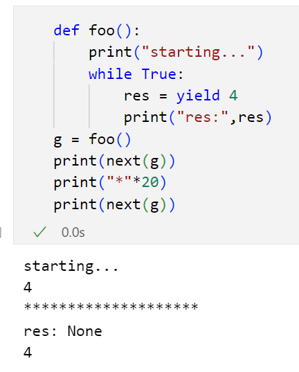
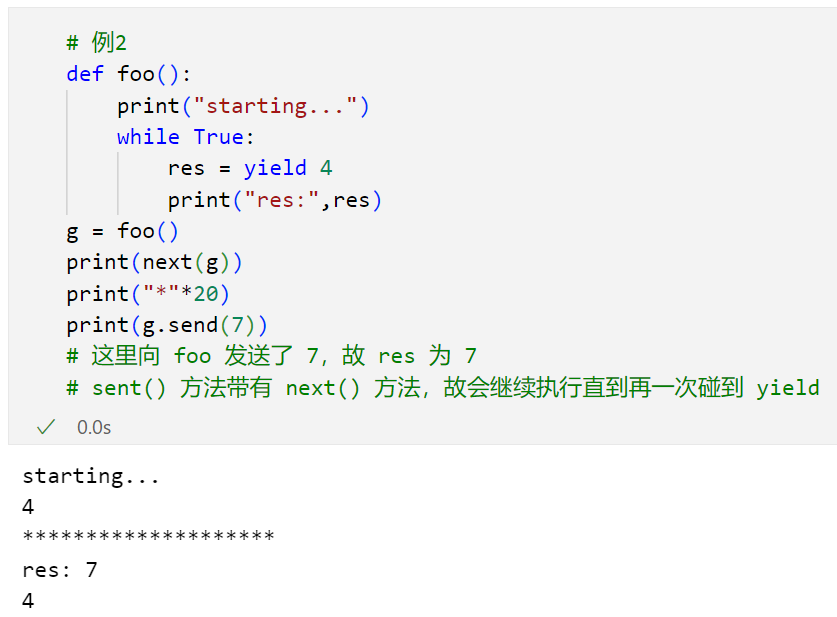

- [常见问题](#1)  
    - [虚拟环境管理](#1_1)  
    - [正则表达式](#1_2)  
    - [PyQt 打包](#1_3)  
    - [`if __name__ == '__main__'`](#1_4)  
    - [递归与回溯](#1_5)  
    - [打字效果](#1_6)  
    - [np.where() 函数](#1_7)  
    - [zip 函数](#1_8)  
    - [绘图相关](#1_9)  
    - [a.empty、a.all()、a.any()](#1_10)  
    - [海象操作符](#1_11)  
    - [排序，并且需要原数组的下标](#1_12)  
    - [局部变量 nonlocal、全局变量 global](#1_13)  
    - [URL 的参数提取问题](#1_14)  
    - [swapaxes 函数](#1_15)  
    - [变量的下划线](#1_16)  
    - [关于 `__call__()`](#1_17)  
    - [求均值、最大、最小](#1_18)  
    - [input 内容的处理](#1_19)  
    - [NaN 值](#1_20)  
    - [subprocess](#1_21)  
    - [可交互 3D 图像示例](#1_22)  
    - [脚本的参数传入](#1_23)  
    - [DataFrame 中 drop 的用法，删除行或者列](#1_24)  
    - [生成独热编码的方式](#1_25)  
    - [奇异值分解和特征值分解](#1_26)  
    - [图像 color bar 设置](#1_27)  
    - [文件打包下载](#1_28)  
    - [mp4 转 gif](#1_29)  
    - [算法题中出现的缓存](#1_30)  
    - [`zip(*nums)` 实现对矩阵的逆时针旋转](#1_31)  
    - [关于 PYTHONPATH](#1_32)  
    - [yield](#1_33)  
    - [Python 的一些模式](#1_34)  
    - [语法糖](#1_35)  
    - [模块、包、库](#1_36)  
    - [utils 文件夹](#1_37)  
    - [网络编程](#1_38)  
    - [并发和并行](#1_39)  
    - [线程、进程](#1_40)  
    - [多线程、协程、异步](#1_41)  
    - [`__str__` 和 `__repr__`](#1_42)  
- [帅地面试题](#2)  
    - [Python 简介](#2_1)  
    - [赋值、浅拷贝、深拷贝](#2_2)  
    - [Python 的作用域](#2_3)  
    - [Python 自省](#2_4)  
    - [Python 提升性能的手段](#2_5)  
    - [字典的 items() 与 iteritems()](#2_6)  
    - [os.path 和 sys.path](#2_7)  
    - [字典与 JSON](#2_8)  
    - [可变、不可变类型](#2_9)  
    - [Python 的内存管理](#2_10)  
    - [模块和包是什么？](#2_11)  
    - [类方法、类实例方法、静态方法](#2_12)  
    - [内存管理机制、调优手段](#2_13)  
    - [内存泄漏](#2_14)  
    - [函数调用时，参数传递的方式](#2_15)  
    - [pass 语句](#2_16)  
    - [super() 作用](#2_17)  
    - [回调函数](#2_18)  
    - [方法重载、方法重写](#2_19)  
    - [函数装饰器的用途](#2_20)  
    - [生成器、迭代器](#2_21)  
    - [is 与 ==](#2_22)  
    - [面向过程、面向对象](#2_23)  
    - [GET 与 POST](#2_24)  
    - [Python2 和 3 的区别](#2_25)  
    - [编码解码](#2_26)  

<div class="container" style="text-align: center;">
    <div class="note">
<a id='1'></a>
        <span class="title1">✨常见问题</span> 
    </div> 
</div>

<a id='1_1'></a>
### ⭕ 虚拟环境管理

为了避免不同项目所需要的不同版本的第三方库之间的冲突，常常需要针对性地设置不同的 Python 虚拟环境，实现项目环境隔离  
假设虚拟环境名字为：`myvirtest`  

- 方法一：venv 包  
    创建虚拟环境 `python3 -m venv myvirtest`  
    切换到目录 `myvirtest\Scripts` 下，激活虚拟环境 `activate.bat` 或者 ` Activate.ps1`  

- 方法二：virtualenv 包  
    国内 pip 镜像下载：`pip install virtualenv -i https://mirrors.aliyun.com/pypi/simple`  
    新建虚拟环境 `$ virtualenv -p python3 myvirtest`  
    进入虚拟环境 `$ source myvirtest/bin/activate`  
    若需要指定 python 版本：`$ virtualenv --python=python3.6 myvirtest`  
    
    > [!NOTE|style:flat]
    > 本机需要自带对应版本的 python 才可以指定虚拟环境 python 版本，例如这里本机需要有 python3.6 才行  

<a id='1_2'></a>
### ⭕ 正则表达式

[在线测试 👈](https://goregex.cn/)  
[例子 👈](https://blog.csdn.net/wenwen1538/article/details/40950159/)  

> [!NOTE|style:flat]
> 不同的开发环境，正则表达式知识略有不同  

- 作用  
    1、数据验证。例如查看字符串内是否为电话号码模式或信用卡号码模式等等  
    2、替换文本。识别文档中的特定文本，完全删除该文本或者用其他文本替换它  
    3、从字符串中提取子字符串  

- 普通字符  
    `[一些字符]` 匹配方括号中的字符，凡是在里面的都给筛出来  
    `[^一些字符]` 同上，但是反向筛选  
    `[A-Z]` 给定一个区间，无需将 26 个字符都写出  
    `.` 表示任意字符，但是不包括换行和回车。等同于 `[^\n\r]`  
    `[\w]` 包括字母、数字、下划线。等同于 `[A-Za-z0-9_]`  
    `\d` 匹配一个数字字符。等同于 `[0-9]`  
    `\D` 匹配一个非数字字符。等同于 `[^0-9]`  
    `[\s]` 所有空白符（包括换行）  
    `[\S]` 所有非空白符  

- 特殊字符  
    `$`  
    `()` 子表达式的开始和结束位置  
    `*` 前面的子表达式>=0，**贪婪的** 会尽可能多的匹配文字  
    `+` 前面的子表达式>=1，**贪婪的** 会尽可能多的匹配文字  
    `?` 前面的子表达式 0/1 次，或者 **非贪婪** 限定符  
    `.`  
    `[`  
    `\`  
    `^` 输入字符串的开始位置，或者在方括号中表示反向筛选  
    `{` 标记限定符表达式的开始  
    `|` 两项之间的一个选择  
    
    > 一般在 `*` 和 `+` 的后面加上一个 `?` 实现非贪婪或最小匹配  
    `<.*>` 是贪婪匹配，从 < 开始，遇到最后一个 > 为止，贪婪匹配会尽可能地返回 **满足条件的最长的字符串**  
    `<.*?>` 非贪婪或最小匹配，从 < 开始，遇到第一个 > 就停止  
    
    >（若要匹配特殊字符地原本字符，则需要加 \ 转义）

- 限定字符（指定出现多少次）  
    `*` 前面的子表达式>=0  
    `+` 前面的子表达式>=1  
    `?` 前面的子表达式=0/1  
    `{n}` 连续出现 n 次  
    `{n,}`   
    `{n,m}` 注意逗号和两个数之间 **不能有空格**  

- 定位字符（描述字符串或单词的边界）  
    `^` 和 `$` 分别指字符串的开始与结束  
    `\b` 描述字与空格间的位置  
    `\B` 表示非单词边界  
    > 不能将限定符与定位符一起使用  

- 选择  
    `exp1(?=exp2)` 查找 exp2 前面的 exp1  
    `(?<=exp2)exp1` 查找 exp2 后面的 exp1  
    `exp1(?!exp2)` 查找后面不是 exp2 的 exp1  
    `(?<!exp2)exp1` 查找前面不是 exp2 的 exp1  

%accordion% 应用（修改 GPU 的 Num），点击展开代码 %accordion%

``` python
import re
a = """
class ConversationBot:
    def __init__(self):
        print("Initializing VisualChatGPT")
        self.llm = OpenAI(temperature=0)
        self.edit = ImageEditing(device="cuda:6")
        self.i2t = ImageCaptioning(device="cuda:4")
        self.t2i = T2I(device="cuda:1")
        self.image2canny = image2canny()
        self.canny2image = canny2image(device="cuda:1")
        self.image2line = image2line()
        self.line2image = line2image(device="cuda:1")
        self.image2hed = image2hed()
        self.hed2image = hed2image(device="cuda:2")
        self.image2scribble = image2scribble()
        self.scribble2image = scribble2image(device="cuda:3")
        self.image2pose = image2pose()
        self.pose2image = pose2image(device="cuda:3")
        self.BLIPVQA = BLIPVQA(device="cuda:4")
        self.image2seg = image2seg()
        self.seg2image = seg2image(device="cuda:7")
        self.image2depth = image2depth()
        self.depth2image = depth2image(device="cuda:7")
        self.image2normal = image2normal()
        self.normal2image = normal2image(device="cuda:5")
        self.pix2pix = Pix2Pix(device="cuda:3")
        self.memory = ConversationBufferMemory(memory_key="chat_history", output_key='output')
"""

pattern = re.compile('cuda:\d')
re.findall(pattern, a)
# 替换成 cuda:0
result, number = re.subn('cuda:\d', 'cuda:0', a)
print(result, number)
```

%/accordion%

<a id='1_3'></a>
### ⭕ PyQt 打包

参考这里的方法四：https://blog.csdn.net/qq_37354233/article/details/123731111  
以下方法适用于 Windows 系统  
先到官网 https://www.python.org/downloads/ 找到开发所用的 Python 版本，选择下载 embeddable 那个压缩包  
之后解压到自己想要的路径下，将写好的 Python 脚本也放在同一个目录下  
将运行所需要的第三方库都复制到路径 `\python-3.9.4-embed-amd64\Lib\site-packages\` 下  
之后编写【启动.bat】文件，一般内容如下即可：  

``` batch
@echo off
setlocal enabledelayedexpansion
chcp 65001

::切换到该bat文件所在的目录下
cd %~dp0
cd 项目文件夹路径

::设置 Qt 的临时环境变量
set QT_QPA_PLATFORM_PLUGIN_PATH=..\python-3.9.4-embed-amd64\Lib\site-packages\PySide6\plugins\platforms
echo %QT_QPA_PLATFORM_PLUGIN_PATH%

..\python-3.9.4-embed-amd64\python.exe .\main.py
@pause
```
需要修改的地方就是上面第四行 python.exe 的位置和 Python 脚本 main.py 的位置  
之后双击 bat 文件，检查是否运行成功。若显示部分包缺失再手动安装  

<a id='1_4'></a>
### ⭕ `if __name__ == '__main__'`

每一个模块（.py 文件）都有 `__name__`  

- 当模块被 **直接执行** 时  
    此时 `__name__=='__main__'`  

- 而作为外部模块 **被其他模块导入** 时  
    此时 `__name__` 为 **模块文件名**，程序会执行被导入模块的 **所有代码**（所以需要将测试代码放在这个 `if __name__ == '__main__'` 的条件下）  

<a id='1_5'></a>
### ⭕ 递归与回溯

我们在路上走着，前面是一个多岔路口，因为我们并不知道应该走哪条路，所以我们需要尝试。尝试的过程就是一个函数。我们选择了一个方向，后来发现又有一个多岔路口，这时候又需要进行一次选择。所以我们需要在上一次尝试结果的基础上，再做一次尝试，即在函数内部再调用一次函数，这就是 **递归** 的过程。这样重复了若干次之后，发现这次选择的这条路走不通，这时候我们知道有一个路口选错了，所以通过撤销或取消之前的决策，然后进行新的选择或路径，这就是 **回溯** 的思想  

递归函数通常包括两个主要部分——基本情况（Base Case）和递归情况（Recursive Case）。基本情况是当问题被划分到最小规模时，可以直接解决的情况。递归情况是将问题分解为更小规模的子问题，并通过调用自身来解决这些子问题  

在递归过程中，每个递归调用都会在内存中形成一个称为 **调用栈** 的数据结构。调用栈存储了每个递归函数的局部变量、返回地址和其他信息。递归调用会在调用栈中形成一个栈帧，当递归结束时，栈帧会从栈顶依次弹出，从而实现逐级返回  

> 递归算法可能具有较高的时间和空间复杂度，需要考虑优化  

%accordion% 树的路径问题 %accordion%

``` python
class Solution:
    def binaryTreePaths(self, root):    #二叉树路径
        if not root:    #若节点为空，则返回空列表
            return []
        if not root.left and not root.right:    #若左右节点为空，则返回当前节点的值构成的列表
            return [str(root.val)]
        
        paths = []
        if root.left:
            for i in self.binaryTreePaths(root.left):    #递归左节点
                print(str(root.val), i)
                paths.append(str(root.val) + '->' + i)
        if root.right:
            for i in self.binaryTreePaths(root.right):    #递归右节点
                print(str(root.val), i)
                paths.append(str(root.val) + '->' + i)
        print(paths)
        return paths
```

%/accordion%

%accordion% 汉诺塔问题 %accordion%

``` python
# 规则：每次移动柱子上的第一个盘，到另一个柱子上；大盘不能放在小盘上面
# 思路：将问题转换成子问题，要移动所有盘子到柱3上
     # 首先将柱1最底下的大盘移动到3，前提是前(N − 1)个盘子已经按顺序摆在了柱2上
     # 接下来就是一个子问题：将(N − 1)个盘从柱2移动到柱3，前提是前(N − 2)个盘子已经按顺序摆在了柱1上
     # 。。。。。。

def TowersOfHanoi(numberOfDisks, startPeg=1, endPeg=3): #共三个柱子
    """
    numberOfDisks:当前盘子的号码 总共四个盘子 号码1~4对应盘子从小到大
    startPeg:起始的柱子
    endPeg:结束的柱子
    """
    if numberOfDisks > 0:
        TowersOfHanoi(numberOfDisks-1, startPeg, 6-startPeg-endPeg) # 1+2+3=6
        print(f"Move disk {numberOfDisks} from peg {startPeg} to peg {endPeg}") #将几号盘子从几号柱子移到几号柱子
        TowersOfHanoi(numberOfDisks-1, 6-startPeg-endPeg, endPeg)


TowersOfHanoi(numberOfDisks=4) #指定4个盘子
```

%/accordion%

%accordion% 八皇后问题 %accordion%

``` python
# 规则：在8x8的棋盘上，摆上8个皇后，确保之间不会冲突（皇后的横、纵以及两个斜对角线上都不能放皇后）
# 思路：类似于暴力搜索的问题

def is_conflict(solution, newpos): #用于判断新摆放的皇后是否与之前放好的冲突
                                    # 冲突返回True
                                    # 不冲突返回False
    '''
    示例：
    solution = [(0,0), (1,2)]
    newpos = (2,3)
    '''
    for pos in solution:
        # 同行，同列，对角线都算冲突
        if pos[0] == newpos[0] or pos[1] == newpos[1] \
            or abs(pos[0] - newpos[0]) == abs(pos[1] - newpos[1]):
            return True
    return False

def play(row=0, solution=[]):
    """
    solution是一个列表，里面是皇后放置的坐标
    """
    checker = 8
    # 从第一行开始放
    if row == checker: #row等于8说明皇后摆放完毕
        yield solution #返回结果
    else:
        for i in range(checker): #否则遍历一到八列，看看能否放置皇后
            newpos = (row, i)
            if not is_conflict(solution, newpos): #如果不冲突，则继续按照这条路放置下去
                for sol in play(row+1, solution+[newpos]): #进行递归
                    # print(len(sol))
                    yield sol

n = 0
for sol in play():
    n += 1
    print(sol)

    # 可视化棋盘
    for chess in sol:
        start = chess[1] #摆放的列号
        print("🔘"*start, "🔵", "🔘"*(7-start), sep="")
    
    print('~'*30)
print(f'八皇后问题总共 {n} 种解法')
```

%/accordion%

<a id='1_6'></a>
### ⭕ 打字效果

``` python
# print 的一些参数
print('hello', 'world', sep='555', flush='', end='')
```

``` python
import time
import random

text = 'hello world'
for ch in text:
    print('|', end='', flush=True)
    time.sleep(0.2)
    print('\b', end='', flush=True)
    
    num = random.randrange(1, 30)/100
    time.sleep(num)

    print(ch, end='', flush=True)
```

<a id='1_7'></a>
### ⭕ np.where() 函数

``` python
import numpy as np
nums = np.arange(1, 11)[::-1]
print(nums)    #nums是多维数组也是可行的
index = np.where(nums>3) #返回满足条件的下标
index[0] #返回的index是一个元组，所以这里取[0]
# 注意里面的值表示的是满足where条件的元素下标
```

<a id='1_8'></a>
### ⭕ zip 函数

``` python
a = [1, 2, 3]
b = ['hello', 'world']
c = [a, b]

print('list(zip(c)):\t\t', list(zip(c)))
print('list(zip(*c)):\t\t', list(zip(*c))) #结果等价于list(zip(a, b))，zip(*)相当于把c解压，ab不再是一个整体而是一一对应
```

<a id='1_9'></a>
### ⭕ 绘图相关

- 不同库的多子图绘制方法  
    ``` python
    import matplotlib.pyplot as plt

    # 创建2x2的子图布局
    fig, axes = plt.subplots(2, 2)

    # 在每个子图中绘制数据
    axes[0, 0].plot(x1, y1)
    axes[0, 1].plot(x2, y2)
    axes[1, 0].plot(x3, y3)
    axes[1, 1].plot(x4, y4)

    plt.show()
    ```

    ``` python
    import seaborn as sns

    # 创建FacetGrid
    grid = sns.FacetGrid(data, col='category', row='subcategory')

    # 在每个子图中绘制数据
    grid.map(plt.plot, 'x', 'y')

    plt.show()
    ```
    
    ``` python
    from plotly.subplots import make_subplots
    import plotly.graph_objects as go

    # 创建4个子图的图表
    fig = make_subplots(rows=2, cols=2)

    # 在每个子图中添加图形
    fig.add_trace(go.Scatter(x=x1, y=y1), row=1, col=1)
    fig.add_trace(go.Scatter(x=x2, y=y2), row=1, col=2)
    fig.add_trace(go.Scatter(x=x3, y=y3), row=2, col=1)
    fig.add_trace(go.Scatter(x=x4, y=y4), row=2, col=2)

    fig.show()
    ```

- 通过 ax 设置子图的参数  
    可以使用它来设置坐标轴、标签、标题、线条样式等  

<a id='1_10'></a>
### ⭕ a.empty、a.all()、a.any()

``` python
import pandas as pd
a = pd.Series([True, False, True])

print(a.empty) #判断是否为空，是返回True，否返回False
print(a.all()) #判断是否全为True，是返回True，否返回False
print(a.any()) #判断是否存在True，是返回True，否返回False
```

<a id='1_11'></a>
### ⭕ 海象操作符

Walrus operator，于 Python 3.8 版本引入  
海象操作符使用符号 `:=`，允许在表达式中 **同时进行变量赋值和表达式求值**  
``` python
# 注意两边的圆括号不能少
>>> (a := 123)
123

>>> (a := [2,4,6])
[2,4,6]

>>> (a := 'hello')
'hello'

>>> (a := '  ^_^  ')
'  ^_^  '
```

<a id='1_12'></a>
### ⭕ 排序，并且需要原数组的下标

``` python
a = ['ab', 'abcde', 'abc', 'abcd', 'a',]
temp = sorted(enumerate(a), key=lambda x:len(x[1]), reverse=True) #根据字符串的长度降序排列，注意使用 enumerate 函数
idx = [i[0] for i in temp]    #原本字符串的位置下标
problem = [i[1] for i in temp]    #排好序后的数组 a
```

若是 numpy 数组，则可以：  
``` python
import numpy as np
a = np.array([4,2,1,100,-4])
b = a.argsort()    #直接得到各元素排好序后对应的下标
a[b]    #即排好序的数组
```

<a id='1_13'></a>
### ⭕ 局部变量 nonlocal、全局变量 global

详见：https://blog.csdn.net/xCyansun/article/details/79672634  

- 1、两者使用的范围不同  
    - global 关键字可以用在任何地方，包括最上层函数中和嵌套函数中，即使之前未定义该变量，global 修饰后也可以直接使用  
    - 而 nonlocal 关键字只能用于 **嵌套函数** 中，并且**要在外层函数中定义相应的局部变量**，否则会发生错误  

- 2、两者的功能不同  
    - global 关键字修饰变量后标识该变量是全局变量，对该变量进行修改就是修改全局变量  
    - 而 nonlocal 关键字修饰变量后标识该变量是上一级函数中的局部变量，如果上一级函数中不存在该局部变量，nonlocal 位置会发生错误（最上层的函数使用 nonlocal 修饰变量必定会报错）

> 注意减少 global 变量的使用，减少资源消耗  

<a id='1_14'></a>
### ⭕ URL 的参数提取问题

``` python
from urllib.parse import urlparse, parse_qs

url = 'https://www.google.com/search?newwindow=1&biw=1091&bih=763'

params = parse_qs(urlparse(url).query)

print(params)
print(params['newwindow'])
print(params['biw'])
```

> 注意  
导入特定的函数会比导入整个模块更加高效  
因为导入整个模块会将整个模块的代码加载到内存中，而导入特定的函数或类 **只会加载需要的部分，可以减少内存的使用量，并减少加载时间**  
这对于大型项目或需要频繁导入的代码来说尤为重要  

<a id='1_15'></a>
### ⭕ swapaxes 函数

对于 numpy 数组来说，可以快速地交换两个 axis 的位置  
``` python
import numpy as np
arr = np.arange(24).reshape((2, 3, 4)) #假设一开始的 shape 是 (2, 3, 4)

arr.swapaxes(0, 1) #交换第一个和第二个轴，变成 (3, 2, 4)

arr.swapaxes(0, 2) #交换第一个和第三个轴，变成 (4, 3, 2)

arr.swapaxes(1, 2) #交换第二个和第三个轴，变成 (2, 4, 3)
```

<a id='1_16'></a>
### ⭕ 变量的下划线

- 前置的单下划线：`_something`  
    约定用于 **提示** 其他程序员，此类一般 **供内部使用**  
    
    > 注意  
    通过通配符 * 导从模块中导入所有函数，Python 将不会导入前置单下划线的函数  

- 后置的单下划线：`something_`  
    防止自己定义的属性名与 Python 内置的关键字 **重名**，可以简单的加一个下划线  

- 前置的双下划线：`__something`  
    遇到这类 Python 解释器会 **重写属性名称**，避免子类中命名冲突

- 前后置的双下划线：`__something__`  
    一般不这样定义，因为双下划线常用于 `__init__`、`__call__`、`__iter__`、`__next__` 这些方法  

- 单独的下划线：`_`  
    例如 `for _ in range(n)`，充当用不到的变量  

<a id='1_17'></a>
### ⭕ 关于 `__call__()`

调用函数时，若需要 **额外运行某些内容**，则可以重写 `__call__()` 函数，例如  
``` python
class A:
    def __call__(self, name):
        print('我的名字是：{}'.format(name))
        res = self.forward(name) #调用下面的 forward 函数
        return res
    def forward(self, input_):
        print('forward 函数被调用了')
        print('传入参数类型是：{}'.format(type(input_)))
        return input_

>>> a = A()
>>> input_param = a('python')
我的名字是：python
forward 函数被调用了
传入参数类型是：<class 'str'>
```

<a id='1_18'></a>
### ⭕ 求均值、最大、最小

``` python
import numpy as np
arr = np.random.uniform(20, 40, size=(4, 5))

# 计算每行的均值，每列相加再除以列数
row_mean = arr.mean(axis=1)

# 计算每列的均值，每行相加再除以行数
col_max = arr.max(axis=0)

# 获取最小值的索引
index_min = arr.argmin()
```

<a id='1_19'></a>
### ⭕ input 内容的处理

``` python
a, b, c = map(int, input().split(','))
a, b, c
```

<a id='1_20'></a>
### ⭕ NaN 值

``` python
import numpy as np
print(np.NaN is np.NaN)    #True
print(np.NaN == np.NaN)    #False
```

<a id='1_21'></a>
### ⭕ subprocess

``` python
# https://www.cnblogs.com/lgj8/p/12132829.html
# 用subprocess这个模块来产生子进程，并连接到子进程的标准输入/输出/错误中去，还可以得到子进程的返回值
import subprocess

# 例子
p = subprocess.Popen("df -h", shell=True, stdout=subprocess.PIPE)    #查看磁盘分区挂载情况
out = p.stdout.readlines()
for line in out:
    print(line.strip())
p.communicate()
# 使用 subprocess 模块的 Popen 调用外部程序，stdout 或 stderr 参数是 pipe
# 推荐使用 Popen.communicate()
# 因为当程序输出超过操作系统的 pipe size 时，如果使用 Popen.wait() 方式等待程序结束获取返回值，会导致死锁，程序卡在 wait() 调用上
```

<a id='1_22'></a>
### ⭕ 可交互 3D 图像示例

``` python
import numpy as np
import scipy.special as sc
import matplotlib.pyplot as plt
def drumhead_height(n, k, distance, angle, t):
    kth_zero = sc.jn_zeros(n, k)[-1]
    return np.cos(t) * np.cos(n*angle) * sc.jn(n, distance*kth_zero)
# 弧度
theta = np.r_[0:2*np.pi:50j]
radius = np.r_[0:1:50j]
x = np.array([r * np.cos(theta) for r in radius])
y = np.array([r * np.sin(theta) for r in radius])
z = np.array([drumhead_height(1, 1, r, theta, 0.5) for r in radius])

# 交互图像绘制
from ipywidgets import interact, fixed
# elev控制观察的角度，azim控制左右的旋转
def plot_3D(elev=20, azim=50, x=x, y=y, z=z):
    fig = plt.figure(figsize=(10, 8))
    ax = plt.subplot(projection='3d')
    ax.plot_surface(x, y, z, rstride=1, cstride=1, cmap='RdBu_r', vmin=-0.5, vmax=0.5)
    ax.view_init(elev=elev, azim=azim);
    ax.set_xlabel('X')
    ax.set_ylabel('Y')
    ax.set_zlabel('Z')
    ax.set_xticks(np.arange(-1, 1.1, 0.5))
    ax.set_yticks(np.arange(-1, 1.1, 0.5))

interact(plot_3D, elev=[20, 90], azim=(-180,180),
            x=fixed(x), y=fixed(y), z=fixed(z)
);
```

<a id='1_23'></a>
### ⭕ 脚本的参数传入

``` python
import os
import argparse
class Parser():
    def __init__(self, description):
        self.parser = argparse.ArgumentParser(description=description)
        self.args = None
        self._parse()
    
    def _parse(self):
        """
        设置传参格式、类型、默认值、help内容
        """
        self.parser.add_argument(
            '--path', type=str, default=None,
            help='图片集合的路径')
        self.parser.add_argument(
            '--resize', type=str, default='512x512',
            help='修改图片大小为 512x512 (default: 512x12)')
        self.parser.add_argument(
            '--rename', type=str, default='no',
            help='整理修改文件名 (default: 不修改)')

        self.args = self.parser.parse_args()


description = None
print(Parser(description).args.path)
print(Parser(description).args.resize)
print(Parser(description).args.rename)
```

<a id='1_24'></a>
### ⭕ DataFrame 中 drop 的用法，删除行或者列

``` python
import pandas as pd
df = {
    'DataBase':['mysql','test','test','test','test'],
    'table':['user','student','course','sc','book']
}
df = pd.DataFrame(df)

# 删除行
df.drop(index=(df.loc[df['table']=='sc'].index), inplace=False)
# 删除列
df.drop(columns=['table'])
```

<a id='1_25'></a>
### ⭕ 生成独热编码的方式

``` python
# 方法一
sklearn 里面的 One-HotEncoder 方法

# 方法二
pd.get_dummies()
```

<a id='1_26'></a>
### ⭕ 奇异值分解和特征值分解

先由一个非对称的矩阵 A 得到对称矩阵 A1 和 A2  
然后对 A1 做特征值分解得到右奇异向量和奇异值  

> 奇异值分解得到的奇异值 == 奇异矩阵特征值分解的特征值开根号  

根据公式推出左奇异向量  
最后根据 USV.T 得到原矩阵的近似矩阵  
``` python
# https://zhuanlan.zhihu.com/p/29846048
import numpy as np
A = np.array([[0, 1], [1, 1], [1, 0]])
A1 = A.T @ A    #右奇异矩阵，对称正交矩阵
A2 = A @ A.T    #左奇异矩阵
u, s, vT = np.linalg.svd(A)    #奇异值分解，适用于所有类型的矩阵，包括方阵或者非方阵。注意这里的s是一个向量，存放各个奇异值
eval1, evec1 = np.linalg.eig(A1)    #得到右奇异向量
# eval2, evec2 = np.linalg.eig(A2)    #注意不可以直接求解左奇异向量,存在正负号的问题
print(np.allclose(np.sqrt(eval1[0]), s[0]))

smat = np.zeros([u.shape[1], vT.shape[0]])    #初始化一个方阵smat，其对角线元素是s
smat[range(s.shape[0]), range(s.shape[0])] = s
print(u @ smat @ vT)

evec2 = A@evec1/np.sqrt(eval1)    #根据US=AV推出左奇异向量u
smat = np.zeros([evec2.shape[0], evec1.T.shape[0]])
smat[range(eval1.shape[0]), range(eval1.shape[0])] = np.sqrt(eval1)
# 注意若 A 不是方阵，则这样推出的左奇异向量构成的矩阵会缺少几列向量，需要补零向量
evec2 = np.append(evec2, np.zeros([evec2.shape[0], smat.shape[0]-evec2.shape[1]]), axis=1)    #右侧添零向量

print(evec2 @ smat @ evec1.T)    #重构出的近似原矩阵
```

<a id='1_27'></a>
### ⭕ 图像 color bar 设置

``` python
import numpy as np
import matplotlib.pyplot as plt
import seaborn as sns

a = np.array([[1,2,3], [4,5,6], [7,8,9]])
fig, ax = plt.subplots(1,1, figsize=(10, 8))
ax = sns.heatmap(a, annot=True, annot_kws={'fontsize':20}, cbar=False)    #取消热力图自带的cbar
mycbar = ax.figure.colorbar(ax.collections[0])
mycbar.ax.tick_params(labelsize=15)

plt.xticks(fontsize=18)
plt.yticks(fontsize=18)

plt.show()
```

<a id='1_28'></a>
### ⭕ 文件打包下载

``` python
!zip -q -r output.zip "\文件夹路径。。。\*"

from IPython.display import FileLink
FileLink('output.zip')
```

<a id='1_29'></a>
### ⭕ mp4 转 gif

``` python
from moviepy.editor import *

clip = (VideoFileClip(r"。。。.mp4").subclip(t_start=1, t_end=2).resize(0.5))    #resize中也可以直接传入元组设置画面大小
clip.write_gif(r"。。。.gif", fps=15)
```

<a id='1_30'></a>
### ⭕ 算法题中出现的缓存

``` python
from functools import lru_cache
def test(a,b):
    print('开始计算a+b的值...')
    return a + b
print('1+2等于:', test(1, 2))
print('1+2等于:', test(1, 2))
# 开始计算a+b的值...
# 1+2等于: 3
# 开始计算a+b的值...
# 1+2等于: 3

print('='*10)

@lru_cache(maxsize=None) # 等价于@cache
def test(a,b):
    print('开始计算a+b的值...')
    return a + b
print('1+2等于:', test(1, 2))
print('1+2等于:', test(1, 2))    #这里会直接调用缓存中已存在的结果
# 开始计算a+b的值...
# 1+2等于: 3
# 1+2等于: 3
```

<a id='1_31'></a>
### ⭕ `zip(*nums)` 实现对矩阵的逆时针旋转

``` python
nums = [[7,2,1],[6,4,2],[6,5,3],[3,2,1]]
print(nums)
print(list(zip(*nums)))
```

<a id='1_32'></a>
### ⭕ 关于 PYTHONPATH

设置 PYTHONPATH 环境变量的作用，https://github.com/ydf0509/pythonpathdemo  

pycharm 会自动把项目根目录加到了 PYTHONPATH  
cmd 中设置临时的环境变量：`set PYTHONPATH=项目根目录 & python run.py`  
win10/11 的 powershell：`$env:PYTHONPATH="项目根目录" & python run.py`  
linux：`export PYTHONPATH=项目根目录;python run.py`  

设置多个环境变量，linux是 : 隔开，win是 ; 隔开 `export PYTHONPATH=/codes/proj1:/codes/proj2`  

手动硬编码 sys.path 的方法（即在脚本中添加搜索路径）不可取，因为这样需要对每个脚本进行修改，费时费力  
在控制台命令行部署运行任何项目，把PYTHONPATH设置为 **项目根目录路径** 是最合适的  

运行任何python项目设置 PYTHONPATH 为当前项目根目录的 4 个好处：  
1、任意项目目录下的任意深层级文件夹下的多个脚本都可以轻松作为python运行起点  
2、不需要 `sys.path.insert`  
3、使用从项目根目录往下寻找模块，用绝对导入，写的脚本位置可以四处移动，代码非常牢固，可靠性高  
4、与 pycharm 的运行行为保持了一致  

> `sys.path` 越靠前的文件夹路径越优先被查找  


<a id='1_33'></a>
### ⭕ yield

[<===](https://blog.csdn.net/mieleizhi0522/article/details/82142856)  
**每次碰到 yield，执行完后会停止，直到 next 操作时，再从停止的位置开始执行**  

<div class="img_container" style="margin: 0px auto 20px auto; width: 50%; height: auto;">
    
</div>

``` python
# 例1
def foo():
    print("starting...")
    while True:
        res = yield 4
        print("res:",res)
g = foo()
print(next(g))
print("*"*20)
print(next(g))
```

执行步骤：  
1、foo 函数中有 yield 关键字，所以 foo 函数并不会真的执行，而是先得到一个生成器 g（相当于一个对象）  
2、直到调用 next 方法，foo 函数正式开始执行。先执行 foo 函数中的 print 方法，然后进入 while 循环  
3、程序遇到 yield 关键字，把 yield 想像成 return，return 4 之后，程序停止，并没有执行赋值给 res 操作，此时 next(g) 语句执行完成  
4、程序执行 print("*"*20)，输出 20 个 *  
5、再执行下面的 print(next(g))，这时和上面类似，不同的是需要从前面 next 程序停止的地方开始执行，也就是要执行 res 的赋值操作。这时候要注意，这个时候赋值操作的右边是没有值的，所以这个时候 res 的值是 None  
6、程序会继续在 while 里执行，若执行 next 操作，则又会碰到 yield，这个时候同样 return出 4  

<div class="img_container" style="margin: 0px auto 20px auto; width: 50%; height: auto;">
    
</div>

``` python
# 例2
def foo():
    print("starting...")
    while True:
        res = yield 4
        print("res:",res)
g = foo()
print(next(g))
print("*"*20)
print(g.send(7))
# 这里向 foo 发送了 7，故 res 为 7
# sent() 方法带有 next() 方法，故会继续执行直到再一次碰到 yield
```

通过将 yield 与生成器结合使用，可以 **实现惰性计算，从而减少内存占用**。生成器是一种特殊类型的迭代器，使用 yield 语句来生成值，每次生成一个值后就会暂停执行，并保持当前的状态，等待下一次调用时继续执行。相比于一次性生成所有值并存储在内存中，生成器每次只会生成一个值，因此可以显著减少内存使用量  

<a id='1_34'></a>
### ⭕ Python 的一些模式

- 抽象工厂模式

``` python
import random

class PetShop:
    """
    一个宠物商店类
    """
    def __init__(self, animal_factory=None):
        self.pet_factory = animal_factory    #抽象工厂

    def show_pet(self):
        """
        使用抽象工厂创建并显示宠物
        """
        pet = self.pet_factory.get_pet()
        print("This is a lovely", pet)
        print("It says", pet.speak())
        print("It eats", self.pet_factory.get_food())

# 工厂生产的东西
class Dog:
    def speak(self):
        return "woof"

    def __str__(self):
        return "Dog"

class Cat:
    def speak(self):
        return "meow"

    def __str__(self):
        return "Cat"

# 工厂类别
class DogFactory:
    def get_pet(self):
        return Dog()

    def get_food(self):
        return "dog food"

class CatFactory:
    def get_pet(self):
        return Cat()

    def get_food(self):
        return "cat food"

# 创建合适的家族
def get_factory():
    """
    动态随机选择宠物工厂
    """
    return random.choice([DogFactory, CatFactory])()


# 展示各工厂的宠物
if __name__ == "__main__":
    shop = PetShop()    #工厂animal_factory默认为None，所以这里可以不用传入
    for i in range(3):
        shop.pet_factory = get_factory()    #设置实例shop的属性
        shop.show_pet()
        print("=" * 20)
    # 实例化一次类，可以通过指定属性，达到使用多次的效果
```
通过使用抽象工厂和具体工厂类，**客户端代码与具体宠物类的实现解耦**，并且可以根据需要动态切换不同的工厂，从而创建不同的宠物  

- 适配器模式

``` python
class Dog(object):
    def __init__(self):
        self.name = "Dog"

    def bark(self):
        return "woof!"

class Cat(object):
    def __init__(self):
        self.name = "Cat"

    def meow(self):
        return "meow!"

class Human(object):
    def __init__(self):
        self.name = "Human"

    def speak(self):
        return "hello"

class Car(object):
    def __init__(self):
        self.name = "Car"

    def make_noise(self, octane_level):
        return f"vroom{'!' * octane_level}"

class Adapter(object):
    """
    通过替换方法来改写对象
    Usage:
    dog = Dog
    dog = Adapter(dog, dict(sound=dog.bark))
    """
    def __init__(self, obj, adapted_methods):
        """
        我们在对象的 dict 中设置了 adapted methods
        """
        self.obj = obj
        self.__dict__.update(adapted_methods)

    def __getattr__(self, attr):
        """
        所有 non-adapted 的调用都传递给对象
        """
        return getattr(self.obj, attr)

def main():
    objects = []
    dog = Dog()
    objects.append(Adapter(dog, dict(sound=dog.bark)))
    cat = Cat()
    objects.append(Adapter(cat, dict(sound=cat.meow)))
    human = Human()
    objects.append(Adapter(human, dict(sound=human.speak)))
    car = Car()
    car_noise = lambda: car.make_noise(5)
    objects.append(Adapter(car, dict(sound=car_noise)))

    for obj in objects:
        print("A", obj.name, "goes", obj.sound())

if __name__ == "__main__":
    main()
```
在这段代码中，我们有几个类：Dog、Cat、Human和Car，它们分别拥有不同的行为和方法。然后通过Adapter类将这些类的方法统一  
适配器类在创建时会设置自己的 `__dict__`，以将适配后的方法添加到自身的属性中。此外，`__getattr__` 方法用于将所有未适配的方法调用传递给原始对象  
通过适配器模式，我们可以 **将不兼容的类的接口转换成统一的接口**，从而使它们能够协同工作，并且客户端代码不需要关心不同对象的具体实现细节  

<a id='1_35'></a>
### ⭕ 语法糖

- 函数装饰器  
    比如：@classmethod，@staticmethod，@property，@xxx.setter，@wraps()，@func_name  
    装饰的对象是 **函数或者方法**  
    作用：改变被装饰函数或者方法的功能、性质  
    装饰器经常被用于有 **切面需求** 的场景，较为经典的有 **插入日志、性能测试、事务处理** 等  

    ``` python
    @funA
    def funB():
        #...
    
    # 将 funB 作为参数传给 funA() 函数  
    # 将 funA() 函数执行完成的返回值反馈回 funB
    ```
    
    ``` python
    @funA
    @funB
    @funC
    def fun():
        #...

    fun = funA( funB( funC(fun) ) )
    ```

- 实例方法  
    即类里面定义的函数  
    一般通过 **实例化后的类对象访问**  
    若想要通过类名访问，必须传入实例对象名，也可以直接传入字母c？？？  

- 类方法  
    ``` python
    class ...:
        @classmethod
        def info(cls):
            print("正在调用类方法", cls)
    ```
    推荐 **直接通过类名调用**  
    > 注意  
    如果没有 ＠classmethod，则 Python 解释器会将 info() 方法认定为实例方法，而不是类方法  

- 静态方法  
    静态方法定义在类这个空间（类命名空间）中，而函数则定义在程序所在的空间（全局命名空间）中  
    类的静态方法中 **无法调用任何类属性和类方法**  
    ``` python
    class ...:
        @staticmethod
        def info(name, add):
            print(name, add)
    ```
    也是推荐 **直接通过类名调用**  

- 实用的方法  
    hasattr() 函数用来判断某个类实例对象是否包含指定名称的 **属性或方法**  
    getattr() 函数获取某个类实例对象中指定 **属性** 的值，若是方法则返回方法的状态  
    setattr() 它最基础的功能是 **修改类实例对象中的属性值**。其次，它还可以实现 **为实例对象动态添加** 属性或者方法  
    issubclass(cls, class_or_tuple) 检查 cls 是否为第二个参数中类的 **子类**  
    isinstance(obj, class_or_tuple) 检查 obj 是否为第二个参数中类的 **实例**  

<a id='1_36'></a>
### ⭕ 模块、包、库

- 模块  
    一个模块就是一个 .py 文件，里面定义了一些函数和变量，需要的时候就可以导入这些模块（.py文件），特点是规模较小  

    - 调用模块方式  
        - 1、`from 模块名 import 函数名`  
        - 2、`import 模块名，然后可以使用 as 为模块或函数起一个别名`  

    > `from 模块名 import *`，这样可以直接把模块里的所有函数导入，但是不推荐，不同模块之间可能存在重名函数  

    用 import 语句导入模块，Python 会按照下列路径依次寻找目标模块：  
    - 1、当前的工作目录  
    - 2、PYTHONPATH（一个环境变量）中的所有目录  
    - 3、Python 默认的安装目录  

- 包  
    多个模块放在一个文件夹，就是一个包  

    为了方便管理而将 .py 文件进行打包。包目录下第一个文件便是 `__init__.py`（特点），然后是一些模块文件和子目录等  

    - 其有下列性质  
        - 1、包本身也是一个模块  
        - 2、模块名不是 `__init__`，而是包的名字，也就是装着 `__init__.py` 文件的文件夹名  
        
        > `__init__.py` 的作用是将一个文件夹变为一个 Python 模块  
        它一般会包含一些 Python 初始化代码（例如批量导入需要的模块），在这个包被 import 的时候，这些代码会自动被执行。不过什么也不写也是可以的  

    - 调用方法，与调用模块类似  
        - 1、`import 包名.模块名`  
        - 2、`import 包名.模块名 as 模块别名`  

- 库  
    具有相关功能模块的集合  
    这也是 Python 的一大特色之一，Python 具有强大的标准库、第三方库以及自定义模块  
    严格来说 Python 中是没有库（library）的概念，其实是借用其他编程语言的概念，库没有特别具体的定义，只是一个通俗的说法  
    所以平时说的库，既可以是一个模块，也可以是一个包  

<a id='1_37'></a>
### ⭕ utils 文件夹

通常用于存放项目中使用的 **工具函数或辅助功能** 的代码文件  
通过将这些功能封装成函数或类，可以在项目的不同部分进行 **重复使用**，提高代码的 **可维护性和复用性**。例如：  
1、数据处理函数：用于处理数据集、数据转换、数据清洗、特征提取等操作  
2、文件操作函数：用于读取和写入文件、创建目录、删除文件等操作  
3、日期时间处理函数：用于日期时间的格式化、计算、转换等操作  
4、字符串处理函数：用于字符串的拼接、分割、替换、编码解码等操作  
5、日志记录函数：用于记录程序运行过程中的日志信息，方便调试和错误追踪  

<a id='1_38'></a>
### ⭕ 网络编程

- 内置库  
    - socket：提供了一组简单的套接字 API，可以用于客户端/服务器编程。涵盖了网络通信的很多细节，套接字、绑定地址、监听请求等等  
    - SocketServer：简化网络服务器的开发，是对 socket 库的一个封装，实现了 **多线程、多进程** 等服务器，帮助你快速开发服务器端程序  
    - httplib：提供了一组 API，可以用于发送 HTTP 请求和解析 HTTP 响应  
    - urllib：提供了一组 API，可以用于打开和读取 URL  

- 第三方库  
    - BeautifulSoup：可以用于解析 HTML 和 XML 文档，方便爬虫编程  
    - Scrapy：高级的爬虫框架  

> TCP 发送数据时，TCP 连接已建立好，所以不需要指定地址  
UDP 是面向无连接的，每次发送要先指定是发给谁  
服务端与客户端不能直接发送列表，元组，字典。需要字符串化 `repr(data)`  

- 在通讯过程中，两端设备的信息传输方式  
    - 单工（单向通信）：只有一端设备可以发送信息，另一端只能接收信息，且发送和接收信息不能同时  
    - 半双工（半双向通信）：两端设备既可以发送，也可以接收信息，但两端 **不能同时发送**。两端 **各自占有** 通讯频道，在不同的时间段内 **交替发送和接收信息**  
    - 全双工（全双向通信）：两端设备既可以发送，也可以接收信息，并且两端 **可以同时发送**。两端设备可以 **同时占有** 通讯频道，并且 **同时进行信息的传输**  

- 全双工实例  
    - 服务器端  
        ``` python      
        import socket
        import threading

        server_socket = socket.socket(socket.AF_INET, socket.SOCK_STREAM)
        # 绑定端口
        server_socket.bind(('0.0.0.0', 8000))
        # 监听
        server_socket.listen()

        connection, address = server_socket.accept()
        print(f'Accepted connection from {address}')

        def receive_data():
            while True:
                data = connection.recv(1024).decode()
                if not data:
                    break
                print(f'Received data: {data}')

        def send_data():
            while True:
                data = input('Enter message to send: ')
                connection.sendall(data.encode())
                if data == 'quit':
                    break

        receive_thread = threading.Thread(target=receive_data)
        send_thread = threading.Thread(target=send_data)

        receive_thread.start()
        send_thread.start()

        receive_thread.join()
        send_thread.join()

        connection.close()
        ```
    
    - 客户端  
        ``` python
        import socket
        import threading

        client_socket = socket.socket(socket.AF_INET, socket.SOCK_STREAM)
        client_socket.connect(('localhost', 8000))
        
        # 此处的代码块同上服务端的
        
        client_socket.close()
        ```
    
    开启两个终端，先运行服务端，再运行客户端

<a id='1_39'></a>
### ⭕ 并发和并行

- 并发（Concurrency）  
    是指 **多个任务交替执行的能力**  
    在并发中，多个任务在时间上交错执行，每个任务执行一小段时间，然后切换到下一个任务  
    这种交错执行的方式可以使得多个任务 **看起来是同时进行的**，虽然实际上每个任务 **并不一定在同一时刻** 执行。在单核处理器上实现，通过 **时间片轮转** 等技术进行任务切换  

- 并行（Parallelism）  
    是指 **多个任务同时执行的能力**  
    在并行中，多个任务真正地在 **同一时刻执行**，每个任务使用不同的执行单元或处理器，从而显著提高了整体的执行速度  
    需要 **多核处理器或者分布式系统** 的支持  
  
并发和并行都涉及多个任务同时执行的概念  
它们都旨在 **提高程序执行效率和资源利用率**  

> 注意  
并发和并行并不是绝对的对立关系  

<a id='1_40'></a>
### ⭕ 线程、进程

程序 > 进程 > 线程  
一个程序里面至少有一个进程，一个进程里面至少有一个线程，**线程之间资源是共享的**。每个进程都有一个独立的内存空间，但这也使得 **进程之间不能共享内存**  
操作系统创建进程需要分配独立的内存空间，所以创建线程的代价也比较小  

线程是操作系统能够进行 **运算调度的最小单位**，线程之间可以 **并发进行**，且共享一个进程的所有资源，这使得同一进程的线程之间容易实现通信（难点是处理好同步与互斥）  

在 Python 解释器中，虽然可以创建多个线程，但只有一个线程能够在任意时刻执行 Python 字节码（通常指 CPython 解释器），其他线程处于等待状态（即 Python 的多线程不能真正的做到并行计算，可以考虑多进程）  
全局解释器锁（GIL）是 CPython 解释器的一个特性。它是一种限制机制，**确保同一时间只有一个线程可以执行字节码**。GIL 的存在是为了 **保证 CPython 的内存管理能够安全运行，同时避免细粒度的数据同步问题**  
在一个线程拿到 GIL 后，它可以执行一段时间，然后释放 GIL，让其他线程有机会执行，具体的执行过程如下：  
1、线程获取 GIL  
2、Python 解释器调度操作系统原生线程，并执行相关的计算任务  
3、执行时间片结束或因为 I/O 等原因需要释放 GIL，将 GIL 让给其他线程  
4、其他线程再次获取 GIL，继续执行自己的计算任务  
5、这个过程不断重复，**每个线程轮流获取 GIL 并执行自己的任务**，通过上下文切换（context switch）实现多线程并发执行  

> 多进程适用于 CPU 密集型操作（例如多数位的 **浮点运算**）  
多线程适用于 IO 密集型操作（例如 **数据读写** 操作） 

> 当一个线程遇到耗时操作并解开了 GIL 后，它会让其他线程先执行，但是 **它自己并不会停止运行**。解开 GIL 只是允许其他线程在 Python 解释器中执行，而不是让当前线程停止运行，这一点与串行运行不同  

<a id='1_41'></a>
### ⭕ 多线程、协程、异步

- 多线程（Multithreading）  
    程序可以同时执行多个线程，每个线程都是 **独立执行** 的，具有自己的 **指令流和栈空间**  
    多线程在 **处理并行任务** 时非常有用，可以提高程序的性能和响应能力，特别是在涉及 I/O 操作或需要同时处理多个任务的情况下  

    - 两类代码  
        I/O 密集型（文件处理、网络请求爬虫等涉及文件读写的操作）  
        CPU 密集型（各种循环处理、计算等）  

    > 注意  
    Python 的多线程不能真正做到并行处理（因为 GIL 锁）  
    在 Python 中，对于 I/O 密集型任务，由于 **线程在等待 I/O 完成时会释放 GIL**，所以可以实现并发执行并提高性能；CPU 密集型的多线程会涉及 **GIL 的释放与再竞争**，而导致执行效率下降  
    
    threading 模块  
    https://zhuanlan.zhihu.com/p/91601448  
    https://www.cnblogs.com/luyuze95/p/11289143.html  

    锁，为了确定执行线程的先后顺序  
    https://zhuanlan.zhihu.com/p/94344847  

- 协程（Coroutines）  
    一种用户级线程，也称为轻量级线程或子程序。和多线程不同，协程在执行过程中可以 **主动地暂停和恢复**，并且可以在代码中进行 **交互**  
    协程通常用于 **处理大量的并发任务**，可以显著提高程序的效率和可伸缩性  
    asyncio 模块  

- 异步编程（Asynchronous Programming）  
    使得程序能够以 **非阻塞** 的方式处理 **并发任务**，从而提高效率  
    通常使用异步函数、回调函数或协程等技术来实现  
    异步编程在处理 **I/O 密集型任务** 时尤为有效，可以最大限度地利用计算资源  
    asyncio、aiohttp、asyncpg、celery、**funboost** 等库  

    https://zhuanlan.zhihu.com/p/587412153  
    https://github.com/ydf0509/funboost  
    https://funboost.readthedocs.io/zh/latest/index.html  

都是可用于 **处理并发任务** 的编程模型，可以充分利用计算资源，提高程序的性能和响应能力  
它们都可以在执行任务时实现 **非阻塞** 的特性，从而避免资源的浪费和效率低下的问题  

- 实例  
    - 异步网络请求：使用 aiohttp 库进行异步网络请求的练习。您可以编写一个程序，同时发送多个 HTTP 请求，而不会阻塞主线程。这可以用于实现高性能的网络爬虫或 API 请求  
    ``` python
    import aiohttp
    import asyncio

    async def fetch_url(url):
        async with aiohttp.ClientSession() as session:
            async with session.get(url) as response:
                return await response.text()

    async def main():
        urls = ["https://example.com", "https://example.org", "https://example.net"]
        tasks = [fetch_url(url) for url in urls]
        responses = await asyncio.gather(*tasks)
        for response in responses:
            print(len(response))

    if __name__ == "__main__":
        asyncio.run(main())
    ```

    - 异步文件操作：使用 aiofiles 库进行异步文件操作的练习。这允许您并发地读写文件，而不会阻塞程序  
    ``` python
    import aiofiles
    import asyncio

    async def write_to_file(filename, data):
        async with aiofiles.open(filename, 'w') as file:
            await file.write(data)

    async def read_from_file(filename):
        async with aiofiles.open(filename, 'r') as file:
            return await file.read()

    async def main():
        await write_to_file('example.txt', 'Hello, async file I/O!')
        data = await read_from_file('example.txt')
        print(data)

    if __name__ == "__main__":
        asyncio.run(main())
    ```

<a id='1_42'></a>
### ⭕ `__str__` 和 `__repr__`

`print` 会优先调用 `__str__`，如若没有定义则会调用 `__repr__` 方法  
`__repr__` 主要用于调试和开发，输出的内容包括对象的类型、值等信息  
`__str__` 的输出更加直观和易读  

---

<div class="container" style="text-align: center;">
    <div class="note">
<a id='2'></a>
        <span class="title1">✨帅地面试题</span> 
    </div> 
</div>

<a id='2_1'></a>
### ⭕ Python 简介

- 是一个编程语言
- 是解释型脚本语言，无需编译，只需要解释器，但是运行速度慢于编译型语言
- 动态类型语言，声明变量时无需说明类型
- 适合面向对象编程，支持通过组合与继承的方式定义类
- 强类型语言。不允许不同类型相加

> 解释型、编译型  
计算机不能直接理解高级语言，需要 **翻译成机器语言**  
解释型语言在 **运行程序** 时进行翻译  
编译型语言在执行之前需要一个专门的 **编译过程**，把程序编译成机器语言（可执行文件）  

<a id='2_2'></a>
### ⭕ 赋值、浅拷贝、深拷贝

- 赋值  
    Python 中的赋值是简单的 **对象引用**，不会创建新对象  
    若 `b = a`，则 `a` 和 `b` **指向同一片内存空间**，可以使用 `id()` 查看  
    若修改 `a`，则 `b` 也会跟着改变  

- 浅拷贝  
    三种形式：  
    - 切片操作：`b = a[:]` 或者 `b = [x for x in a]`  
    - 工厂函数：`b = list(a)`  
    - copy 函数：`b = copy.copy(a)`  
    
    以上操作都会创建新对象，通过 `id()` 查看 `b` 和 `a` 的内存空间是不同的  
    
    > 注意  
    若 `a` 里面有 **嵌套的列表**，它们指向的位置还是一样的。即对 `a` 中的列表进行修改，`b` 对应的也会改变  

- 深拷贝  
    `b = copy.deepcopy(a)`  
    `b` 是全新的对象，与 `a` **没有任何关联**  
    时间、空间开销更高  

> 注意  
数字、字符是 **非容器类型**，没有拷贝一说  

<a id='2_3'></a>
### ⭕ Python 的作用域

搜索顺序：  
Local，本地作用域  
Enclosing Local，当前作用域被嵌入的本地作用域  
Global，全局作用域  
Built-in，内置作用域  


<a id='2_4'></a>
### ⭕ Python 自省

即自我检查能力  
`dir()`，可以用来查看 **对象的属性名称**  
`type()`，查看对象的 **类型**  
`getattr()`，查看对象的 **属性**  
`hasattr()`，查看对象 **是否拥有某属性**  
`isinstance()`，判断某个对象 **是否是某个特定的类型**  

<a id='2_5'></a>
### ⭕ Python 提升性能的手段

使用 **多进程**  
对性能影响较大的部分使用 c 或者 c++ 编写  
IO 阻塞采用 **IO 多路复用**  
尽量使用 Python 的 **内置函数**  
尽量使用 **局部变量**  

<a id='2_6'></a>
### ⭕ 字典的 items() 与 iteritems()

`items()`，返回值是 **列表** 存储的键值对，没有特殊的顺序  
`iteritems()`，类似，返回的是一个 **迭代器**  

> 注意  
存入字典中的数据没有顺序

<a id='2_7'></a>
### ⭕ os.path 和 sys.path

`os.path` 是对系统路径文件的操作  
`sys.path` 是对 Python 解释器的系统 **环境参数的操作**  

<a id='2_8'></a>
### ⭕ 字典与 JSON

字典：数据结构，要求 **value 需要 hash**  
JSON：数据的表现形式，要求 **value 是字符串**，用双引号  

<a id='2_9'></a>
### ⭕ 可变、不可变类型

可变，内存中的值可以改变，例如：**列表、字典、集合**  
不可变，内存中的值不能改变，例如：数值、字符串、元组  
字典键要求是：不可变对象  

``` python
# 数值类型的变量是不可变的
a = 5
print("a =", a, id(a))

# 若要修改变量值，则会重新开辟一块内存空间存放 a 的值
a = 5 + 1
print("a =", a, id(a))
```

> [!NOTE|style:flat]
> 对不可变类型做深浅拷贝都没用，还是指向同一个地址

<a id='2_10'></a>
### ⭕ Python 的内存管理

Python 私有 **堆空间**：存储对象和数据结构  
Python **内存管理器**：堆空间分配  
内置 **垃圾收集器**：回收未使用的内存，并使其可用于堆空间  

<a id='2_11'></a>
### ⭕ 模块和包是什么？

Python 中 **每个代码文件都是模块**，模块可以引用其他模块  
**包中含有多个代码文件**，里面可以包含模块和子文件夹  

<a id='2_12'></a>
### ⭕ 类方法、类实例方法、静态方法

类方法：类对象的方法，使用 "@classmethod" 来装饰，形参为 cls  
类实例方法：类实例化对象的方法，形参为 self，指代对象本身  
静态方法：使用 "@staticmethod" 来装饰  

<a id='2_13'></a>
### ⭕ 内存管理机制、调优手段

涉及到引用计数、垃圾回收、内存池

- 引用计数  
    高效，当一个对象被引用时，其引用计数增加 1，不再被引用就减 1，直到为 0 时对象被删除
    
    > 注意  
    若出现 **循环引用，则该机制不起效果**  

- 垃圾回收  
    涉及到引用计数、标记清除、分代回收  
    1、引用计数为 0 时，说明需要被当作垃圾回收了  
    2、标记清除用于 **摘掉循环引用**，得到真实的有效计数。例如两个对象的引用计数都为  1，但是仅存在它们之间的循环引用，说明二者都是需要被回收的  
    3、分代回收，当一个内存块中的垃圾 **回收次数多但是仍旧有垃圾**  存在时，可以考虑和其他的分开处理，**隔一段时间再去回收**，使得处理次数减少，提高效率  

- 内存池  
    1、Python 内存机制呈现金字塔形状，第 -1、-2 层主要由 **操作系统** 来操作  
    2、第 0 层是 C 语言中的 **malloc 和 free** 等内存申请、释放函数来操作  
    3、第 3 层是最上层，Python 对象直接操作  
    由于 Python 在运行期间会 **频繁的执行 malloc 和 free** 操作，这会影响执行效率，所以引入内存池机制用来 **管理对小块内存的申请和释放**。这个小块内存的标准是 256 个字节，小于等于它则在内存池申请，大于它则需要调用 malloc 函数。当然可以通过修改源代码来更改 256 这个值  

<a id='2_14'></a>
### ⭕ 内存泄漏

指的是由于疏忽或错误造成的 **程序未能释放已经不再使用的内存** 的情况  
这会导致程序运行 **速度减慢，系统崩溃** 等  
如何防止：当一个对象不使用时，通过 `del object` 来删除它的 **引用计数**  
获取对象的引用计数：`sys.getrefcount(object)` 并根据返回值来判断内存是否泄漏  

<a id='2_15'></a>
### ⭕ 函数调用时，参数传递的方式

- 参数是 **不可变** 类型时：值传递  
    只能通过 **拷贝** 来进行传递，因为原处不可修改  

- 参数是 **可变** 类型时：引用传递  

<a id='2_16'></a>
### ⭕ pass 语句

编写代码时只写框架思路，先用 pass 占位，程序不会报错

<a id='2_17'></a>
### ⭕ super() 作用

`super()` 是用来解决 **多重继承** 问题的  
单继承的情况下，直接用 **类名调用父类**（Base类）的方法是没问题的  
多继承的情况下，会涉及到 **查找顺序（MRO）、重复调用（钻石继承）** 的问题  

<a id='2_18'></a>
### ⭕ 回调函数

把函数的指针作为参数传递给另一个函数  
简单讲就是一个函数作为另一个函数的参数被传入，那么这个函数叫做回调函数  

<a id='2_19'></a>
### ⭕ 方法重载、方法重写

重载：在同一个类里面，**方法名字相同，参数不同**。让类以统一的方式处理不同类型数据  
> 为了使得方法能够处理不同类型的数据  

重写：**子类继承父类的方法** 并进行一定的修改，又叫方法覆盖  
> 继承并进行一定的修改  

<a id='2_20'></a>
### ⭕ 函数装饰器的用途

装饰器本质上是一个 Python 函数，返回值也是 Python 对象  
作用是让其他函数在 **不需要做改动下增加额外的功能**，减少与函数功能本身无关的雷同代码  
用于有 **切面需求** 的场景：插入日志、性能测试、事务处理、缓存、权限校验等等  
要求函数可以当作参数传递  

<a id='2_21'></a>
### ⭕ 生成器、迭代器

Python 中的 list、dict、tuple 也被称为 **容器对象**  

- 迭代器  
    假设 for 循环遍历一个容器对象，for 语句对容器对象 **调用 `iter()`** 方法，这会返回一个 **定义了 `next()` 方法的迭代器对象**，这个迭代器对象逐个访问容器内的元素  

- 生成器  
    用于 **创建迭代器**。在需要 **返回数据** 的时候执行 `yield` 语句  

区别：生成器能实现迭代器的功能，简洁、高效、节省内存  

<a id='2_22'></a>
### ⭕ is 与 ==

`a is b`，通过比较两个对象的内存地址（即使用id()函数返回的唯一标识）来判断它们是否引用同一个对象  
`a == b`，比较两个对象的值  

> 注意  
对于 **小整数和一些短字符串**，Python 会对它们进行缓存以提高性能，使得两个相同值的对象实际上是同一个对象，这种情况下使用is 运算符比较结果会是 True  
对于大整数或长字符串等，则不会进行缓存  

<a id='2_23'></a>
### ⭕ 面向过程、面向对象

二者是 **程序设计方法**，各有其适用的场景和优劣  
面向过程：基于功能分析，以算法为中心，**将问题分解为一系列的步骤和函数** 进行处理。它强调按照过程来组织和管理代码  
面向对象：基于结构分析，以数据为中心，**将问题看作一组对象及其相互作用**。它强调通过定义和操作对象来解决问题。其中，**类是面向对象的核心概念**，通过类可以创建具体的对象。面向对象编程具有封装、继承和多态这三个重要特性  

> 封装（Encapsulation）  
将数据和操作封装到一个对象中，对外界隐藏内部实现的细节，只提供有限的接口进行访问和操作  
继承（Inheritance）  
允许通过定义新类来继承和扩展现有类的属性和方法。继承可以创建类之间的父子关系，子类可以继承父类的属性和方法，并且可以根据需求进行修改和扩展  
多态（Polymorphism）  
允许将不同类型的对象当作相同类型的对象对待，通过多态性可以实现 **同一个接口实现不同的行为**。多态性提高了代码的灵活性和可扩展性  

<a id='2_24'></a>
### ⭕ GET 与 POST

是 HTTP 协议中的两种常见的请求方法  
GET：用于从指定的资源请求（**获取**）数据  
POST：用于向指定的资源提交（**发送**）被处理的数据，例如 **提交表单** 数据或发送包含敏感信息的数据  
相对于 GET 方法，POST 方法 **将数据放在请求的消息体中**，而不是显示在 URL 中，因此 POST 方法相对来说 **更具有隐蔽性**  

<a id='2_25'></a>
### ⭕ Python2 和 3 的区别

https://www.cnblogs.com/hanggegege/p/5840005.html
黑马博客也有讲

1、print

| Python2 | Python3 |
| --- | --- |
| print 为 class | print 为函数 |
| 不需要括号 | 需要括号 |

2、input()

| Python2 | Python3 |
| --- | --- |
| input 得到的是 int 型<br>（用 row_input 才为 str） | input 得到的是 str 型 |

3、除法

| Python2 | Python3 |
| --- | --- |
| 除数带有小数点，则 `/` 表示真除，否则为结果取整 | `/` 表示真除 |
| `%`表示取余 | 同 Python2 |
| `//`表示地板除，即结果取整 | 同 Python2 |

4、xrange 模块

| Python2 | Python3 |
| --- | --- |
| 使用xrange创建迭代对象 | 使用range |
| range(0, 4)返回的是列表[0,1,2,3] | range(0, 4)返回的是迭代器，需要再通过list()转换成列表 |

<a id='2_26'></a>
### ⭕ 编码解码

``` python
s = "hello world"

b = s.encode( "gbk")    # 字符串 s 编码为 gbk 格式的字节序列

s1 = b.decode("gbk")    # 将字节序列 b以gbk格式 解码为字符串
```


<style> 
    .note { 
        background-color: #f9f9f9; 
        border: 1px solid #ddd; 
        padding: 10px; 
        border-radius: 10px; 
        display: inline-block; 
        font-weight: bold;
        margin: 10px 0px;
    }
    .note:hover {
        animation: gradient-in 0.5s forwards;
    }
    .note:not(:hover) {
        animation: gradient-out 0.5s forwards;
    }
    @keyframes gradient-in {
        0% {
            background-color: #f9f9f9;
        }
        20% {
            background-color: #f5f5f5;
        }
        100% {
            background-color: #e1e1e1;
        }
    }
    @keyframes gradient-out {
        0% {
            background-color: #e1e1e1;
        }
        80% {
            background-color: #f5f5f5;
        }
        100% {
            background-color: #f9f9f9;
        }
    }
    .title1 { 
        font-size: 24px; 
        /* color: #333;  */
    } 
    .title2 { 
        font-size: 20px; 
        /* color: #555;  */
    } 
    .title3 { 
        font-size: 16px; 
        /* color: #777;  */
    } 
    /* .note:hover [class^="title"]{
        font-size: 30px;
        opacity: 0.6;
    } */
</style>